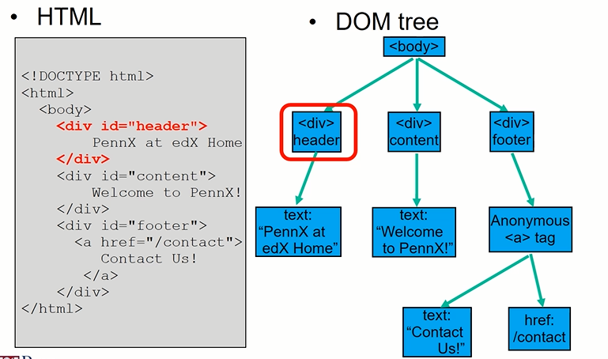
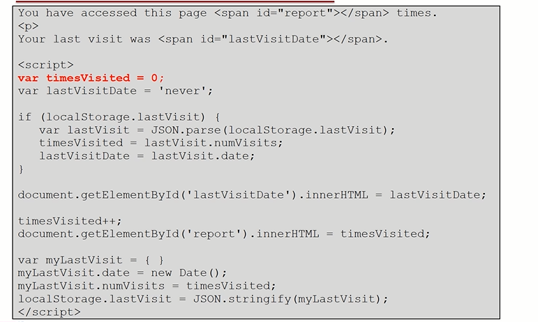
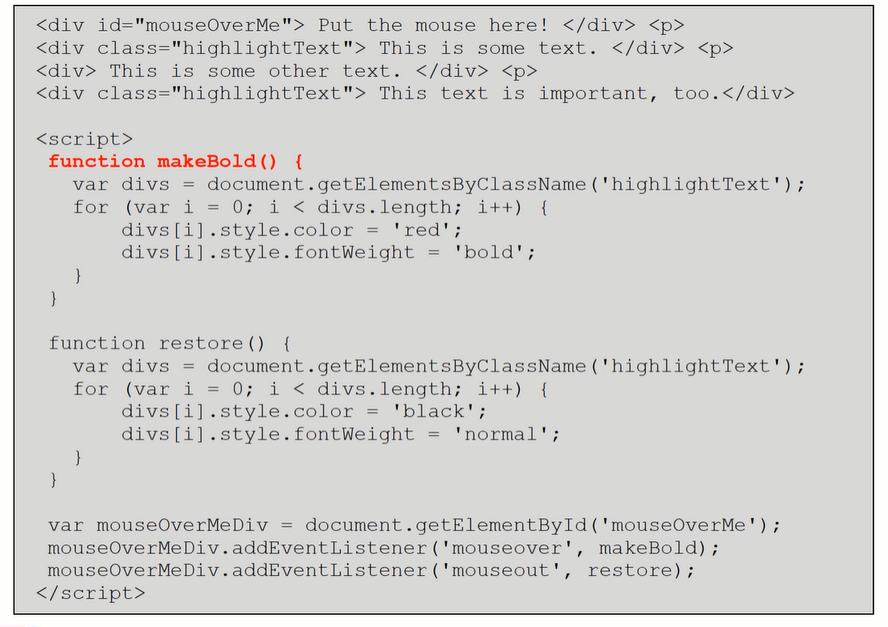
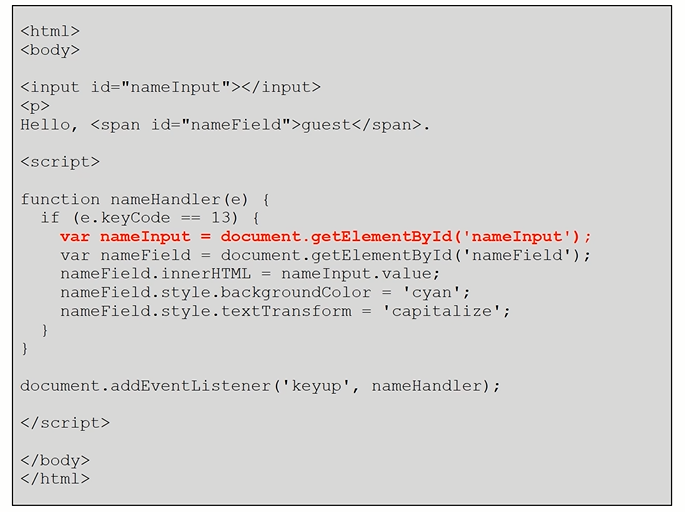

# Dom (Document Object Model)

Is the Tree structure of each html page!


<br/>
<br/>
<br/>

- document

The root DOM object can be accessed by the object called **document** which represent the root of the tree. 

```
<div>
    the current date is <span id='myID'>    </span>
</div>
<script>
    var dateTimeField = document.getElementById('myID')
    dateTimeField.innerHTML = new Date()
</script>
```

We can modify directly the elements inside the DOM with Js.

- localStorage

is used to store data in the browser across multiple pages! we can use javascript also to modify the style of the elements. 

## Convert object to JSON and viceversa:

that's how you can use this. basically first check if we have in the memory an LastVisit object if is not the case set lastVisitDate as initialized ('never' in this case) and display it, then augment the timesVisited by one and display and lastly update localStorage.lastVisit !



The main features that we saw are:

- document.getElementById('id')
- element.innerHTML = 'new value'
- element.style.background = 'new value'
- JSON.stringify(obj)
- JSON.parse(str_obj)
- localStorage.obj ...


# Event Response (EVENT driven programming)

By ID return one single elements


the 'click' is an argument of addEventListener!!


By className returnan array





# jQuery

is package that simplifies javascript usage on webapps. to use in the page you have to downloaded it (put in the head) such as: \<script src='jQueryFile.js'> \</scipt>. one of the most important elements is the symbol **$** that is used to select DOM elements for manupulation:

```
<script src='jQueryFile.js'></scipt>

$('*') // select all the elements
$('this') // current elements
$('div') // al div elementrs
$('.myClass') // all my class
$('#myID') // my id elements
```

Once selected than you typically want to perform such actions on those elements:

```
$('.myClass').html('Hello') // $('.myClass').action(args)
$('.myClass').append(' World!')
$('.myClass').addClass('.otherClass')
$('.myClass').hide()
$('.myClass').show()

$('.myClass').event(callback)
```

Doing again the exercise of the button before but using jQuery it is very simpler.

```
<!DOCTYPE html>
<html>
<head>
    <script src="https://code.jquery.com/jquery-3.6.0.js">
    <meta charset="utf-8">
    <title>Button Listener</title>
</head>
    <body>
        <button id='clickMe'> Click me! </button>
        <p> you have clicked the button <span id='numClick'> 0 times</span>
        <script>
            var n_click = 0;

            function clickHandler(){
                n_click ++;
                var clicks = $('#numClick');
                clicks.html(n_click + 'times');
            }
            $('#clickMe').click(clickHandler);
        </script>

    </body>
</html>
```

another example: 


Another simpler example is:
```
<!DOCTYPE html>
<html>
<head>
    <script src="https://code.jquery.com/jquery-3.6.0.js">
    <meta charset="utf-8">
    <title>Button Listener</title>
</head>
    <body>

        <ul>
            <li>Animal_1</li>
            <li>Animal_1</li>
            <li>Animal_1</li>
            <li>Animal_1</li>
        <ul>

        <scripts>
            function bolderTxt(){
                $('this').css('font-size', '3em')
            }
            $('li').click(bolderTxt)
        </script>
    </body>
</html>
```

# jQuery event handler

## on event

- it allow to combinate multiple function such as:


```
<!DOCTYPE html>
<html>
<head>
    <script src="https://code.jquery.com/jquery-3.6.0.js">
    <meta charset="utf-8">
    <title>Button Listener</title>
</head>
    <body>

        <ul>
            <li>Animal_1</li>
            <li>Animal_1</li>
            <li>Animal_1</li>
            <li>Animal_1</li>
        <ul>

        <scripts>

            $('li').on({
            mouseenter: function() {
                $(this).css('color', 'red');
                $(this).css('font-size', '120%');
            },
            mouseleave: function() {
                $(this).css('color', 'black');
                $(this).css('font-size', '100%');
            },
            click: function() {
                $(this).css('background-color', 'yellow');
            }
            });

        </scripts>
    </body>
</html>

```


- Hover function 

```
        <script>
            function hoIn(){
                $(this).css('color', 'green')
            }
            function hoOut(){
                $(this).css('color', 'red')
            }
            $('li').
```


- ## Advanced selectors


- \$(nodes).find(selector) // $('ul.myClass').find('li')
- $("div.books") // all div with class books
- $('div, .books) // all the divs and all the books

```
<ul class='myClass'>
<li>Hey</li>
<li>Hey</li>
<li>Hey</li>
<li>Hey</li>

<script>
$('ul.myClass').find('li').on{
    mouseenter: ..,
    mouseleaver: .., 
}

</script>

```

# Others events

| Event      |  action |
| ----------- | ----------- |
| Mouse      | click, dblclick, mousedown, mouseup, mouseover, mouse out       |
| keyboard   | keydown, keypress, keyup        |
| form   | focus, blur, change, reset, submit        |
| Window   | load, resize, scroll, unload        |


```
<body>

<input type="password" name="password">

<br>

<span id="errorMessage" class="errorText" hidden="">
     Please fix the following errors:</span>
<ul>
<li id="needsNumber" class="errorText" hidden="">
    The password must contain a number</li>

<li id="atLeast10Chars" class="errorText" hidden="">
    The passsword must be at least 10 characters long</li>
</ul>

<span id="successMessage" hidden="">The password is okay!</span>

<p>

<button name="submit">Validate Password</button>

<script>

$("button[name='submit']").click(function() {
   var passwordField = $("input[name='password']");
   var password = passwordField.val();
   var isOkay = true;
   if (password.length < 10) {
     isOkay = false;
     $('#atLeast10Chars').show();
   }
   if (/\d/.test(password) == false) {
     isOkay = false;
     $('#needsNumber').show();
   }
   if (isOkay == false) {
     $('#successMessage').hide();
     $('#errorMessage').show();
     passwordField.removeClass("goodBox").addClass("errorBox");
   }
   else {
     $('.errorText').hide();
     $('#successMessage').show();
     passwordField.removeClass("errorBox").addClass("goodBox");   
   }
   return false;
});

</script>


</p></body>
```