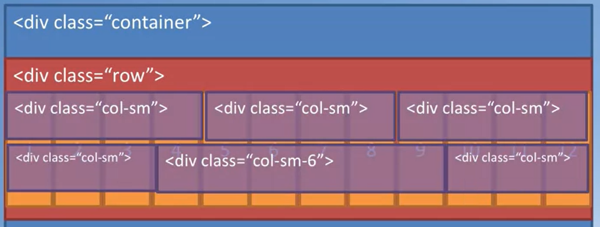
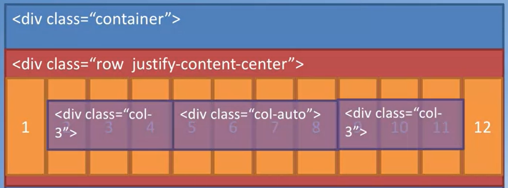
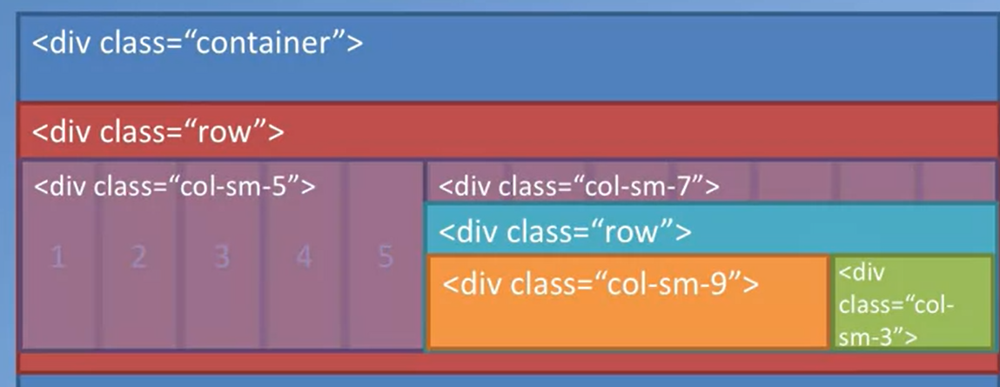

# Bootstrap CSS

## Mobile design first! 

The more efficient approach is starting by developing html for small screen and then adapt it with larger screen. Bootstrap allow to easily handle the responsiveness needed to deal with mobile-phones. we have many elements that helps to do that:

- Grid System
- Fluid Images
- Media Queries

Media queries are one of the most important since are CSS technology to apply base on the size of the viewport. this is basically used to understand which device is watching to your websites and perform operations according to that. the grammar is as:

``` css
@media (min-width:990px){
    .container {
        width:300px;
        max-width:100%;
    }
}
```

## Grid System

is a very useful tool to responsiveness, first we have to declare in the \<head>: **\<meta name='viewport' content='width=device-width, initial-scale=1, shrink-to-fit=no'>** it ensures that the screen width is set tot he device width and the content is rendered with this width in mind.

the bootstrap grid take advantages of the css flex-box layout, it enable to more easier and flexible container. it is used to easy vertical alignment of content within parent elements, it allow easy reordering of content across devices and screen resolutions with the help of media query.

To use the bootstrap grid we first create a container that will be fix its dimensions with the screen sizes with the media query. We can also use the container-fluid which will do the fix automatically! inside we use the div class 'row'. this is the basic bootstrap grid which by default contains 12 elements.

``` html
<div class='container'>
    <div class='row align-items-center'>
        <div class='col-sm-5'> // 5 of 12
            five out of 5
        </div>
        <div class='col-sm-7'> // 5 + 7 = 12 of 12
        </div>
    </div>
</div>
```

the bootstrap grid make available five classes by default such as:

- default (which target all screen sizes)
- xs
- sm
- md
- lr 
- xl

using the classes **.col-\*, .col-sm-\*, col-md-\*, .col-lg-\*.** As we said every row is divided into 12 columns, using this classes we can *specify how many columns is each element large!* 


Using instead the **container-fluid** there is what so called auto-layout columns:



it is also possible to explicitly pass the order of the column using \<div class='col-sm-7 order-sm-first'> while using \<div class='row align-items-center'> is used to align the vertical alignment of the content while the horizontal alignment is done using: \<div class = 'row justify-content-center0>



Lastly we have to **column offsets**  it means that the element from col sm and more will be moved to the right by one. 

Remember that is also possible to nesting columns:



Basically is possible to concatenate classes just separating them with a space such as:

- \<div class='row row-content'> where row-content is my css class

## Containers and row

```html
        <!-- Header jumbotron stay for important elements -->
        <header class='jumbotron'>
            <div class="container">
                <div class='row row-header'>
                    <!-- occupy all the col for xs and half for screen -->
                    <div class='col-12 col-sm-6'> 
                        <h1>Bootstrap Trial</h1>
                        <p> 
                            This is the first bootstrap grid trial This is the first bootstrap grid trial 
                            This is the first bootstrap grid trialThis is the first bootstrap grid trial
                        </p>
                    </div>
                    <!-- the above col will be fixed at the left part! -->
                    <div class='col-12 col-sm'>
                    </div>
                </div>
            </div>
        </header>
```

Remember that:
- Justify --> horizontal
- Align --> Vertical


> <a href='https://getbootstrap.com/docs/4.0/layout/grid/'>Grid references</a>

## Navigation bar

Web site are rarely single pages. we tend to divide hierarchically the websites like a tree structure. when visiting websites the navbar is typically of the top of on the side of websites and provides the information of the websites. the best practice are to use simple anf user-friendly terms, standardize the navigation, provide indication of the location within the navigation hierarchy and use conventions such as the logo that takes you back to home page.

```html
        <!-- Navigation bar -->
        <nav class='navbar navbar-light navbar-expand-sm fixed-top bg-primary'>
            <div class="container">
                <!-- toggle button when xs, the target is what to display -->
                <button class='navbar-toggler' type='button' data-toggle='collapse' data-target="#Navbar">
                    <span class="navbar-toggler-icon"></span>
                </button>
                <a class='navbar-brand mr-auto' href='#' style='padding-right: 25px;'>Logos</a>
                <!-- the main navbar that will collapse when the screen is too size  -->
                <div class='collapse navbar-collapse' id='Navbar'>
                    <!-- mr-auto is is used to align the navbar into the right -->
                    <ul class='navbar-nav mr-auto'>
                        <!-- nav-item, active means that it is highlighted when in that page -->
                        <li class='nav-item active'>
                            <a class='nav-link' href='#'>Home
                                <span class='fa fa-home'></span>
                                
                            </a> 
                        </li>
                        <li class='nav-item'><a class='nav-link' href='/Bootstrap/2_buttons_and_forms.html'>About <span class='fa fa-address-book'></span></a></li>
                        <li class='nav-item'><a class='nav-link' href='#'>Menu</a> </li>
                        <li class='nav-item'><a class='nav-link' href='#'>Contact</a> </li>
                        <li class='nav-item'><a class='nav-link' href='#'>Contact</a> </li>
                    </ul>
                </div>
            </div>
        </nav>
```

we also use **breadcrumbs** that indicate the navigation hierarchy in the websites such as: home->menu->appetizers (path based) which are typically placed blow the primary navigation and above the content.

## breadcrumbs

```html
    <ol class="col-12 breadcrumb">
        <li class="breadcrumb-item"><a href="./1_bootstrap_grid_navbar.html">Home</a></li>
        <li class="breadcrumb-item active">Contact Us</li>
    </ol>
```

bootstrap class is called navbar then we have **navbar-expand-sm** which means that for screen that are sm and larger the navigation bar will be enlarged while **fixed-top** means that the nav-bar will be stay always at the top.

\<a class='navbar-brand'>Logos</a> // inserting the logo


the use of icons is also very useful to make the rendering much better, they are a set of symbols and glyphs and they can be used like regular fonts and there are many icon font packs available. one of the most popular icon fonts is called **font awesome**. the grammar to call is:

```html
<div class="col-12 col-sm-4 align-self-center">
    <div class="text-center">
        <a class="btn btn-social-icon btn-google" href="http://google.com/+"><i class="fa fa-google-plus"></i></a>
        <a class="btn btn-social-icon btn-facebook" href="http://www.facebook.com/profile.php?id="><i class="fa fa-facebook"></i></a>
        <a class="btn btn-social-icon btn-linkedin" href="http://www.linkedin.com/in/"><i class="fa fa-linkedin"></i></a>
        <a class="btn btn-social-icon btn-twitter" href="http://twitter.com/"><i class="fa fa-twitter"></i></a>
        <a class="btn btn-social-icon btn-google" href="http://youtube.com/"><i class="fa fa-youtube"></i></a>
        <a class="btn btn-social-icon" href="mailto:"><i class="fa fa-envelope-o"></i></a>
    </div>
</div>
```
there are also **bootstrap-social** that are social media sign button that helps to show the contacts.

## Buttons and inputs

user interaction need to be supported from the web approaches. the interactions can be facilitated trough three approaches:

```html
<div class='btn-group' role='group'>
    <a role='button' class="btn btn-primary" href='tel:3494403796'><i class='fa fa-phone'></i> Call</a>
    <a role='button' class="btn btn-info"><i class='fa fa-skype'></i> Skype</a>
    <a role='button' class="btn btn-success"><i class='fa fa-envelope-o'></i> Email</a>
    <a role='button' class="btn"></a>
</div>
```

- \<a> tags to provide hyperlinks
- \<buttons> tags to create button
- \<forms> and \<input> create form and elements

## Forms

```html
<form>
    <div class='form-group row'>
        <label for='firstname' class='col-md-2 col-form-label'>First name</label>
        <div class="col-md-10">
            <input type='text' class='form-control' id='firstname' name='firstname' placeholder="First Name">
        </div>
        <label for='lastname' class='col-md-2 col-form-label'>Last name</label>
        <div class="col-md-10">
            <input type='text' class='form-control' id='lastname' name='lastname' placeholder="lastname Name">
        </div>
    </div>
    <div class='form-group row'>
        <label for='telnum' class='col-12 col-md-2 col-form-label'>Contact Tel.</label>
        <div class="col-6 col-md-5">
            <input type='tel' class='form-control' id='telnum' name='telnum' placeholder="telnum">
        </div>
        <div class="col-6 col-md-5">
            <input type='number' class='form-control' id='code' name='code' placeholder="code">
        </div>
    </div>
    <!-- checkbox!  -->
    <div class='form-group row'>
        <div class='col-md-6 offset-md-2'>
            <div class='form-check'>
                <input type='checkbox' class="form-check-input" name='approve' id='approve' value=''>
                <label class="form-check-label" for='approve'><strong>Contact us</strong></label>
            </div>
        </div>
        <div class='col-md-3 offset-md-1'>
            <select class='form-control'>
                <option>Tel.</option>
                <option>Email</option>
            </select>
        </div>
    </div>
    <div class='form-group row'>
        <label for='feedback' class='col-md-2 col-form-label'>Your feedback</label>
        <div class='col-md-10'>
            <textarea class='form-control' id='feedback'></textarea>
        </div>
    </div>
    <div class='form-group row pull-right'>
        <div class='col-md-12'>
            <button class='btn btn-dark  ml-auto'> Send feedback</button>
        </div>
    </div>
</form>
    
```

## Tables

they are meant to display tabular data in a web page.

```html
<table class='table'>

</table>
```

there are different different bootstrap tables such as:
- "table-striped" for zebra striped rows
- "table-bordered" for borders to table cells
- "table-hover" for highlighting rows when you hover over a row
- "table-sm" for cutting the cell padding in half
- "table-responsive" for making the table responsive (scrolling)

individual cell and rows can also be colored such as:
- \<tr class='bg-success'> .. bh-danger and so on.

```html
 <!-- table responsive so it scroll when is to large -->
<div class='table-responsive'>
    <!-- striped = zebra, is a table object! -->
    <table class='table table-striped'>
        <thead class='thead-dark'>
            <tr>
                <th>&nbsp;</th>
                <th>2013</th>
                <th>2014</th>
                <th>2013</th>
                <th>2014</th>
            </tr>
        </thead>
        <tbody>
            <tr>
                <th>Employee</th>
                <td>First</td>
                <td>First</td>
                <th>2013</th>
                <th>2014</th>
        </tbody>
    </table>
```

## Cards

another components available elements in the **bootstrap card**. they are similar to the tables but they allow more flexibility.

```html
<div class='card'>
    <div class='card-header bg-primary text-white text-center'>
        <h3>Facts at a Galnce</h3>
    </div>
    <div class='card-body'>
        <!-- Description list! -->
        <dl class='row'>
            <dt class='col-6'>Started </dt>
            <dt class='col-6'>feb.2013 </dt>
        </dl>
        <dl class='row'>
            <dt class='col-6'>Started </dt>
            <dt class='col-6'>feb.2013 </dt>
        </dl>
    </div>
</div>
```

## Images

bootstrap image classes provide a bounch of classes to apply to the image tag to render the image as responsive as possible such as **img-fluid**. you can also use a **img-thumbnail** which thumbnail the image and also elements to modfiy the shape of the elements such as **rounded cornes or rounded-circle**. they work very well together with the card class.


## media object

```html
 <div class='media'>
    
    <!-- body image -->
    <div class='media-body'>
        <!-- badges -->
        <h3>Utthapizze
            <span class='badge badge-danger'>Hot</span>
            <span class='badge badge-pill badge-secondary'>$4.99</span>
        </h3>
        <p class='d-none d-sm-block'>Hey Hey Hey Hey Hey Hey </p> 
</div>
```

a different way is the **media** object and also the **responsive embeded** wich render the video such:

```html
<div class='embed-responsive embed-responsive-18by9'>
    <iframe class='embed-responsive-item' src='https/..'> </iframe>
</div>
```


## Badges, Alerts and Progress bar

Badges are used to capture the attection, they are tipically use for highlight sales and something like this.

```html
<span class='badge badge-danger'>HOT</span>
<span class='badge badge-pill badge-secondary'></span>
```

the alert classes are messages that pop up from the browsers.

```html
<div class='alert alert-warning alert-dismissible' role='alert'>
    <button type='button' class='close' data.dismiss ='alert'>
        <span>&times;</span>
    </button>
    <strong>Warning</strong> ples to the stuff
</div>
```

in a similar way the progress bar:

```html
<div class='progress'>
    <div class='progress-bar progress-bar-striped' role='progressbar' style='width:80%'> 80% </div>
</div>
```

# Bootstrap Js Components

## Tabs and Pills

Tabs and pills and tabbed navigation, navigation elements fro navigating content within a page tha is organized into multiple panes. tabs are use to **reveal contents**, while the pill based navigation is same but it highlight the part that you are looking at the moments.

```html
<div class='row row-content'>
    <div class='col-12'>
        <h2>Corporate Leaders</h2>
        <ul class="nav nav-tabs">
            <li class="nav-item">
                <a class="nav-link active" href="#peter" role="tab" data-toggle="tab">Peter Pan, CEO</a>
            </li>
            <li class="nav-item">
                <a class="nav-link" href="#peter2" role="tab"  data-toggle="tab">Danny Witherspoon, CFO</a>
            </li>
        </ul>
        <div class='tab-content'>
            <div role='tabpanel' class='tab-pane fade show active' id='peter'> 
                <h3>Peter Pan <small>Chied epicurios</small></h3>
                <p>
                    somethingsomethingsomethingsomethingsomething
                    somethingsomethingsomethingsomethingsomething
                    somethingsomethingsomethingsomethingsomething
                    somethingsomethingsomethingsomethingsomething
                </p>
            </div>
            <div role='tabpanel' class='tab-pane fade' id='peter2'> 
                <h3>Peter second <small>help</small></h3>
                <p>
                    somethingsomethingsomethingsomethingsomething
                    somethingsomethingsomethingsomethingsomething
                    somethingsomethingsomethingsomethingsomething
                    somethingsomethingsomethingsomethingsomething
                </p>
            </div>
        </div>
    </div>
</div>
```

## Collapse and Accordion

toggling of content requires the use of button or alink to trigger the toggle while collapse is not.

```html
<!-- Accordion -->
<div class='row row-content'>
    <div class='col-12'>
        <div id='accordion'>
            <div class="card">
                <div class="card-header" role="tab" id="dannyhead">
                <h3 class="mb-0">
                    <a class="collapsed" data-toggle="collapse" data-target="#danny">
                    Dhanasekaran Witherspoon <small>Chief Food Officer</small>
                    </a>
                </h3>
            </div>
            <div class="collapse" id="danny" data-parent="#accordion">
                <div class="card-body">
                    <p class="d-none d-sm-block">. . .</em></p>
                </div>
            </div>
        </div>
        <div class="card">
                <div class="card-header" role="tab" id="agumbehead">
                <h3 class="mb-0">
                    <a class="collapsed" data-toggle="collapse" data-target="#agumbe">
                    Agumbe Tang <small>Chief Taste Officer</small>
                    </a>
                </h3>
            </div>
            <div class="collapse" id="agumbe" data-parent="#accordion">
                <div class="card-body">
                    <p class="d-none d-sm-block">. . .</p>
                </div>
            </div>
        </div>
        <div class="card">
                <div class="card-header" role="tab" id="albertohead">
                <h3 class="mb-0">
                    <a class="collapsed" data-toggle="collapse" data-target="#alberto">
                    Alberto Somayya <small>Executive Chef</small>
                    </a>
                </h3>
            </div>
            <div class="collapse" id="alberto" data-parent="#accordion">
                <div class="card-body">
                    <p class="d-none d-sm-block">. . .</em></p>
                </div>
            </div>
        </div>
        </div>
    </div>
</div>
```

## Tooltips, popovers and modals

revealing content upon interacting with an element on the web page, **information displayed as an *overlay***.

- tooltips few information hovering on an element

```html
<a role='button' class='btn btn-block btn-warning' 
data-toggle="tooltip" data-html='true' title='or call us at <br>myNumber</br>'
data-placement='bottom'>
    Reserve table
</a>
```

and must activate the bootstrap javascript at the end of the page such as:

```js
$(document).ready(function(){
    $('[data-toggle="tooltip"]').tooltip();
})
```
- popovers more information clicking on an element

- model when you have to display a lot of information or popping up a form.

```html
<!-- trigger in navbar -->
<span class='navbar-text'>
    <a data-toggle='modal' data-target="#loginModal">
        <span class='fa fa-sign-in'></span>
    </a>
</span>

<!-- Modal -->
<div id='loginModal' class='modal fade' role='dialog'>
    <div class='modal-dialog modal-lg' role='content'>
        <div class='modal-content'>
            <div class='modal-header'>
                <h4 class='modal-title'>Login</h4>
                <button type='button' class='close' data-dismiss='modal'>
                    &times;
                </button>
            </div>
            <div class='modal-body'>
                <form>
                    <div class='form-row'>
                        <div class='form-group'>
                            <label>Password</label>
                            <input type="password" class="form-control">
                        </div>
                    </div>
                    <button class='btn btn-primary' data-dismiss='modal'>Sign in</button>
                    <button class='btn btn-secondary'data-dismiss='modal'>Cancel</button>
                </form>
            </div>
        </div>
    </div>
</div>
```

## Carousel

slides of images.

```html
<style>
.carousel {
  background:#512DA8;
}

.carousel-item {
  height: 300px;
}

.carousel-item img {
    position: absolute;
    top: 0;
    left: 0;
    min-height: 300px;
}
</style>
<div class="row row-content">
    <div class="col">
        <div id="mycarousel" class="carousel slide" data-ride="carousel">
            <div class="carousel-inner" role="listbox">
                <div class="carousel-item active">
                    
                    <div class="carousel-caption d-none d-md-block">
                        <h2>Uthappizza <span class="badge badge-danger">HOT</span> <span class="badge badge-pill badge-default">$4.99</span></h2>
                        . . .
                    </div>
                </div>
                <div class="carousel-item">
                        . . .
                </div>
                <div class="carousel-item">
                        . . .
                </div>
            </div>
            <ol class="carousel-indicators">
                <li data-target="#mycarousel" data-slide-to="0" class="active"></li>
                <li data-target="#mycarousel" data-slide-to="1"></li>
                <li data-target="#mycarousel" data-slide-to="2"></li>
            </ol>
            <a class="carousel-control-prev" href="#mycarousel" role="button" data-slide="prev">
                <span class="carousel-control-prev-icon"></span>
            </a>
            <a class="carousel-control-next" href="#mycarousel" role="button" data-slide="next">
                <span class="carousel-control-next-icon"></span>
            </a>
        </div>
    </div>
</div>
```

# jQuery

basic syntax:

- $('selector').action()

```js
$(document).ready(function(){  // when the document is ready then execute the function
    $('[data-toggle="tooltip"]').tooltip() 
    // select all the elements that have data-toggle = 'tooltip' //and enable tooltip()
})
```

selectors can take:

- Any html elements such ah 'p' or 'button'
- Using a specific an #id such as '#myElement'
- By class such as '.btn.btn-default' // chain of class (and)
- **Attribute** that has been applied with **[]** such as '\[href]' all the elements having href!
- Current element using this $(this)

We can also specify jQuery events such as interaction with the DOM:

- Mouse: click, dblclick, mouseenter, mouseleave
- Keyboard: keypress, keydown, keyup
- Form: submit, change, focus, blur
- Document, Windowd: load,resize, scroll, unload

such as: ready(), click(), dblclick() and so on. 

```js
$('#myCarouseul').carousel({interval:2000})

$('#miDiv').on('mouseenter', func(){return 'hi'})
```

Interaction with button an js, example with carousel

```html
<div class='btn group'>
    <button class='btn btn-danger btn-sm' id='pause'><span class='fa fa-pause'></button>
    <button class='btn btn-success btn-sm' id='play'><span class='fa fa-play'></button>
</div>

<script>
$(document).ready(function(){
    $('#pause').click(function(){
        $('#myCarousel').carousel('pause')
    })

    $('#play').click(function(){
        $('#myCarousel').carousel('play')

    })
})
</script>
```

With one single button!

```html
<button class='btn btn-danger btn-sm' id='btn'> <span class='fa fa-pause'></button>

<script>
$(document).ready(function(){
    $('#btn').click(function(){
        // we have to understand with kind of button is!
        if ($('#btn').children('span').hasClass('fa-pause')){
            $('#myCarousel').carousel('play')
            $('#btn').children('span').removeClass('fa-pause')
            $('#btn').children('span').addClass('fa-play')
        } 
        else {
            $('#myCarousel').carousel('cycle')
            $('#btn').children('span').removeClass('fa-play')
            $('#btn').children('span').addClass('fa-pause')
        }
    })
})
</script>
```

# CSS preprocessors: Less and Sass

bootstrap is built using Sass. CSS is great for definin styles and repeatdly applying the to various html elements. CSS is limited when it comes to features like defining variables, nesting selectors, expressions and functions. this preprocessors helps to improve the css language. the typical features that brings are the support for variables, nesting selectors, functions, expressions. 

## SCSS

```scss
$blue: #ddd;
$background-dark: #512da8;
$height: 300px;

@mixin zero-margin{
    margin:0px auto;
    background:@white
    height: $height*2
}

@mixin zero-margin-and-padding ($pd-top, $pd-bottom){
    margin:0px auto;
    padding: $pd-top, $pd.bottom;
    background:@white;
}

.myCustomClass{
    @include zero-margin;
    background: $background-dark
}

//nested classes

.mycarousel{
    @include zero-margin-and-padding(10,10)
    background-color: $background-dark
    .carousel_item{  //nested
        color:red;
    }
}
```

then you have to transform scss to css using the proper package:

> ssass file.scss file.css