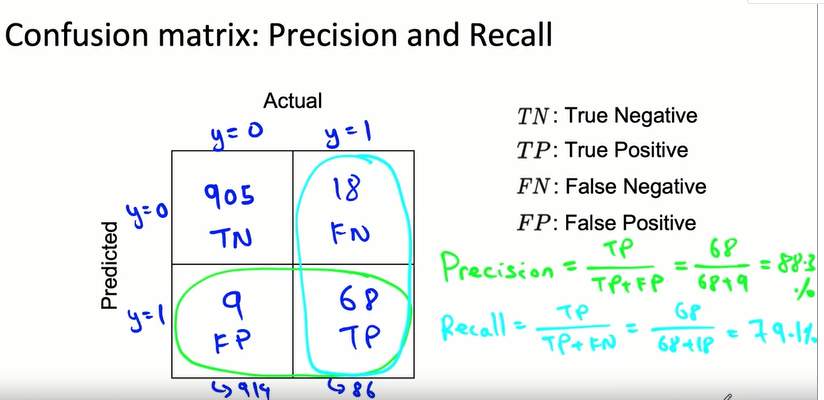
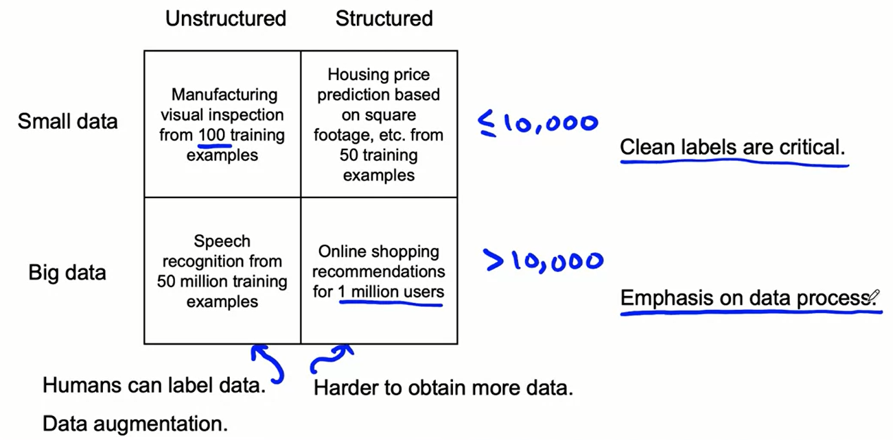
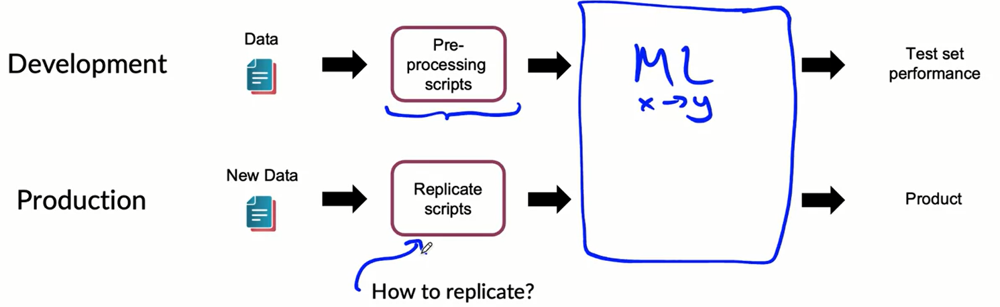

# MLOPS

MLOPS machine learning operation which is an emerging discipline, and comprises a set of tools and principles to supper progress trough the ML project lifecycle.

# Week 1
## ML Project Lifecycle
The model production involves more than only build the actual model. The amount of code required is much more rather than the needed for the model, called "POC to production GAP". Beyond the ml learning we have many others components:

- Data collection
- Data verification
- Feature extraction
- ML CODE
- Machine resource management
- Analysis tools
- Serving infrastructure
- Monitoring

all these pieces combined together create the ML infrastructure needed to deploy a ML production deployment.

### Steps of ML project
the major steps are:

1. **Scoping**: define project, what will be the X and the Y.
2. **Collecting & Defining Data**: define the data, labelling and organize them.
3. **Modelling**: select and train the model and perform error analysis.
4. **Deployment**: deploy in production and monitor and maintain the system.

### Speech recognition example
looking at the steps before the first step is to define the scope, one crucial decision is the **key metrics** used such as accuracy, latency, throughput. We have also to try estimating the resources and times.

the second step regard the data, talking about speech recognition the first questions could be *"is the data labeled consistently?"*. spotting consistency standardizing the convention could improve a lot the results. other question regarding the data could involve *"how much silence before/after each clip?"*, how do you produce *volume normalization?*. 

then we have modelling in which we select and train a model, performing error analysis. in this phase we need to develop the code (model used, the hyperparameters used and the data. in product team usually we tend to change and try improve the hyperparameters and the data and keeping the algorithm fixed. in ML system turns out that is better to optimize the data and the hyperparameters rather than the model!

the last deployment phases involve the first choice if we will use a **prediction server** into the cloud or a **prediction system** in the edge. we send an API to the server with the requests and returning the result. Even after the deployment we have to monitor and maintain the system. for instance if we train the speech recognition model only on adults it could be the case if the system will be used by children it won't work. 

One of the key challenge is the **concept/data Drift**, which occurs when data change.

## Key challenges
### Concept drift and data drift
What happens when the data change after the deployment of the model? how has the data changed? the data can change **gradual** or **suddenly** (when covid appears a lot of credit card issue arise, for instance all were forced to purchase online and this trigger up a lot of anti-freud system). 

1. **Data drift** is the changing of the predictors X, The data drift refers in particular to the change of X and not the target variable.
2. **Concept drift**  refers to the mapping of x -> y(case of covid or if we are estimating the house prices we can say that this occurs when the market house increase, same X but higher Y). 

### Software engineering issues
The prediction software typically take an input X and return an output Y. we have to care about different situations:

1. Realtime or batch data
2. Cloud vs Edge service
3. Compute resources (CPU/GPU/Memory) available
4. Latency and throughput (QueryPerSecond)
5. Logging 
6. Security and Privacy

the fist deployment will be very different from the maintenance of it.

## Deployment patterns
common deployment cases occurs when:

1. New product/capability
2. Automate/assist with manual task
3. Replace previous ML system

Every times we have some route like the gradual ramp up with monitoring (start slow and control, then augment); the possibility of rollback.
an example of implementation could is called **Shadow development** in which ML system shadow the human runs in parallel, the output are not used for any decision during this phase. in this case we are evaluating basically the model.

When we let the algorithm make decision we can use a **Canary development** in which we roll out to small fraction of traffic initially, and we inspect that the model is performing well and we monitor the system and ramp up traffic gradually.

Another deployment patter is the **blue green development**, we are basically changing an old model to a new one. basically we spin up the router from the previous router to the new one. using this approach we can easy enable rollback traffic. 

One of the most useful framework is not to see the deployment as zero-one but thinking as a proper degrees of automation such as:

human only -> shadow mode-> AI assistance -> partial automation -> full automation

## Monitoring ML system
the best way is to use a dashboard that track how it works along time. We can track the serve load, the fraction of non-null outputs, fraction of missing input values. when decide what possible go wrong and find some metrics that can detect that problems. some examples of metric to track could be:

1. **Software metrics**: memory, compute, latency, server load.
2. **input metrics**: average in input length, number of missing values, or particular to the task like average image brightness.
3. **Output metrics**: in case of speech recognition #times return None, # user redoes search.

the key is that only monitoring the system we can understand if there are some changes or some problems into the application and perform some correction.

## Pipeline Monitoring
going on with our speech recognition example, the audio is passed to a voice activity detection (VAD) and if this recognize that someone is speaking then it is passed to the speech recognition and then it perform the transcription. the VAD is very useful so to send to the server only the needed information.

cascading effect can be difficult to track, we can use metrics to monitor to capture the element of each ML steps. 

# Week 2
## Selecting and training a Model
We have two approaches: model-centric AI development and the Data-centric AI development. 

$$AIsystem = Code + Data$$

since the code typically are already provided by others could be useful to improve the quality of the data or the hyperparameters rather than trying to improve the model itself. Model development is an iterative process, model + hyperparameters + code, training, error analysis and again. Model development is hard because they typically doing very well on training set but they have also to perform better on the test set. Lastly they also have to perform well on business metrics/project goals! this problem could occurs when we deal with disproportionally important examples (more errors are weighted more than others). Tne problem could be related to **rare classes** so related to skewed data distribution.

### Establish a Baseline
One of the most useful operation is to **establish a baseline** for the performance of the model. for instance we can check the human level performance in all the situation and try to understand if there are some problems in particular types of task. We can notice that speech recognition in lowe bandwidth condition has an accuracy of 70% as the ML system so there is potential no space for improvement but in another spot there is.

The best practice to create the baseline differs if we are working with structured and unstructured data. When we are dealing with unstructured data like image, audio and text it is very useful to use **HLP** (Human performance performance) to create baseline. Another way to establish a baseline could be the **literature** search for state-of-the-art already present. 

baselines helps to indicates what might be possible. in some cases is also gives a sens of what is irreducible error. 

### Tips for getting started

1. Literature search to see what's possible (do not search the latest super fancy model but pick something reasonable).
2. Establish a baseline.
3. A reasonable algorithm with good data will often outperform a great algorithm with no so good data.
4. Sanity check for code and algorithm, try first on small dataset before passing to the whole dataset.

you also should take into account deployment constraints when picking a model. 

## Error analysis and performance auditing
We can identify possible problems and create a spreadsheet investing personally which are the misclassified or error of the ML system trying to investing where the ML has more problems.

Taking another problem in visual inspection when regarding specific class labels (scratch, dent), or the error could occurs in particular image properties or some other meta-data like the phone model or factory. 

- **What fraction of errors has that tag**?  there could be some very useful indication to reduce the overall errors
- **of all data with that tag, what fraction is misclassified**?
- **what fraction of all the data has that tag?**

we also establish metrics to assess performance against these issues on appropriate slices of data. 

### Prioritizing what to work on
what percentage of data has those category? is worthful to perform and trying to improve the performance on that particular category? we have to control the overall distributions of the records understanding what are the margin to improvement of each class and decide where we can improve the situation.

- how much room for improvement there is.
- how frequently that category appears.
- or how easy is to improve accuracy in that category?
- how important it is to improve in that category.

### Skewed datasets
Many scenario have a very unbalance classes or skewed dataset, for instance in manufacturing maybe we can reach 99.7% of y=1 and 0.3 of y=0.3. in this case row accuracy is not a useful metrics because print every time zero can return a 99.7% of accuracy.

More useful is to draw the confusion matrix with the predicted value and the actual value; 

the **precision** is defined as follow:

$$Precision = \frac{TP}{TP+FP}$$

in contrast the **recall** is defined as follow:

$$recall = \frac{TP}{TP+FN}$$

- what happens when the model spit out every time zero?

in this case the precision is equal to 0/0 while the recall will be 0%.

#### F1-Score
we can combine the precision and the recall in one further measure called **F1 score**.

$$F_{1} = \frac{2}{\frac{1}{P}+ \frac{1}{R}}$$

we can use this metric even when we have multi-class target.

## Data iteration
Having a **model-centric view** having the data that we have we try to improve the results as possible. The academy works in this way, we take the data fixed and interactively we improve the code/model. Another prospective is the **data-centric view** in which the quality of the data is central. We typically have the model fixed while we try to improve the data that we have. 

### Data Augmentation
There many ways to perform data augmentation, we are basically recreating artificially new observation. 

1. Create realistic examples that (i) the algorithm does poorly on, but (ii) humans do well on.

### Data iteration loop
Taking a data centric approach is useful to use a data iteration, we add/improve data, we train the model and we perform error analysis. 

- can adding data hurt performance?

for unstructured data problems, if:

- the model is large (low bias)
- the mapping x->y is clear (also human can make accurate predictions)

then adding data rarely hurts accuracy. But if the model is not large in that case it could case problem. the second problem is when the mapping from x->y is not clear. 

### Experiment tracking
There is a need to track the experiment and the result done so far. Something that we have to track is:

1. Algorithm/code versioning
2. Dataset used
3. Hyperparameters
4. Save results somewhere

Some tracking tools are:

1. Text files
2. Spreadsheet
3. Experiment tracking system

there is the need to take notes of information needed to replicate results. Experiment results, ideally with summary metrics/analysis. 

## Why define hard is hard?
If we take the image recognition vision we have to care about the data labelling, having inconsistent labelled data could raise many problems. for many practical application the data preparation is crucial to improve the performance of the overall ML works. It could be also the case when dealing with structured data is that the target label is ambiguous!

What is the input X?
- lighting? contrast? resolution? garbage in -> garbage out
- when dealing with structured data, what features need to be included?

What is the target label y?
- how can we ensure consistent label?

### Mayor types of data problems
The problems changes a lot when we are dealing with unstructured vs structured data as well with small data (not precisely defined) or big data.

{width=300}

when we have **small data clean labels are critical**, in particular when we have few observation it could be great to manually go trough each example to be sure that each label is ok!.

for small data cleans labels are critical, there is the possibility to manually look trough dataset and fix labels where needed (important consistent between labels). while for the very big data the focus is the emphasis on data process.

big data problems can have small data challenges too, this problems emerge when we have problems with a large dataset but where there's a long tail of rare vents in the input that will ha small data associated.

### How to improve label consistency
the first common solution is to have multiple labelers label same example and when there is disagreement discuss and reach the definition of the target and perform action according to that. 

- Standardize the labels (find a consistent way of defining labels)
- Merge classes when there are classes similar that are not very well defined (hard vs shallow scratch)
- Introduce alternative as 0, borderline, 1.
- Define special token as \[intelligeble] when there are *data genuinely ambigous*

Human level performance are very useful to estimate reducible error (especially in unstructured data). beyond the estimating error there are some other user of HLP. in academia, it is used to establish and beat a respectable benchmark to support publication. business or product owner asks for 99% accuracy; **HLP helps establish a more reasonable target**.

when the label y come from a human label, HLP << 100% may indicate ambiguous labelling instructions, improving label consistency will raise HLP.

## Label and Organize data
how long should you spend obtaining data? considering that MLOPS is an iterative problems. An advise is to get into the iteration loop as quickly as possible. or if it could be the case we can ask: *if you have worked on the problem before and from experience you know you need M examples*. 

But when there is no idea on how much data are needed and so on, starting the iteration loops as soon as possible is a great option since we can obtain useful information from error analysis. 

when we have to label data whe have three options: **In-house** vs **outsourced** vs **crowdsourced**. Having MLEs label data is expensive, but doing this for just a few days is usually fine. 

### Data Pipeline
given the raw data we have to perform many operations before arriving to the actual prediction. 

{width=300}

POC and production phases, in particular the Proof Of Concept:

- goals is to decide if the application is workable and wortg deploying.
- focus on getting the prototype to work.
- it is ok if data pre-processing is manual (but take extensive notes on how to replicate).

for some application having **meta-data, lineage is very important**. One challenge of the ML pipelines is to be able to decompose it and be able to work on small piece of it. the question is, once having built the pipeline how we can go back and fix problems? 

To solve this problem is important to keep track of data provenance and lineage (where data come from and the sequence of steps that introduce that data into the pipeline). To make life easier we can use extensive use of **meta-data**, which are data about the data itself like the time, factory, camera settings, phone models and so on. 

### Balanced train/dev/test splits in small data problems

When we have small data we have to really care about the splitting. Perform a random train/test split is nod advisable (also when we have unbalanced class). A possible solution is to split the dataset according to the target distribution!.

- also important control for the distribution of the target variable before and after the split to control that the relative frequencies are well distributed.