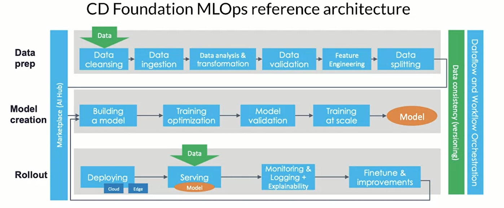
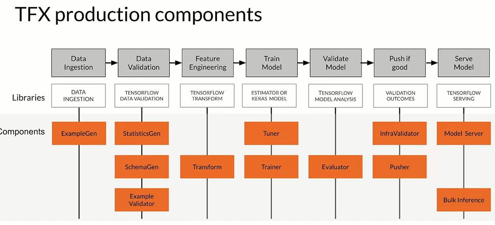
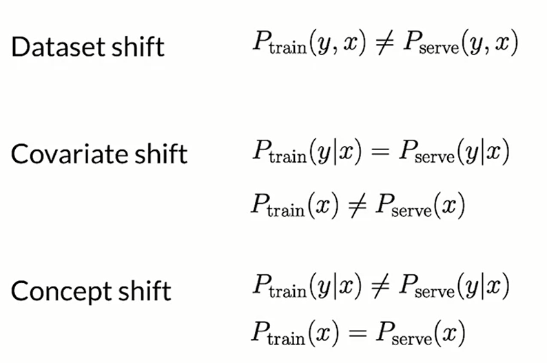
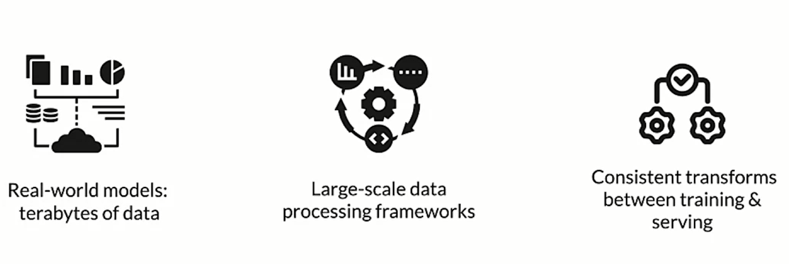
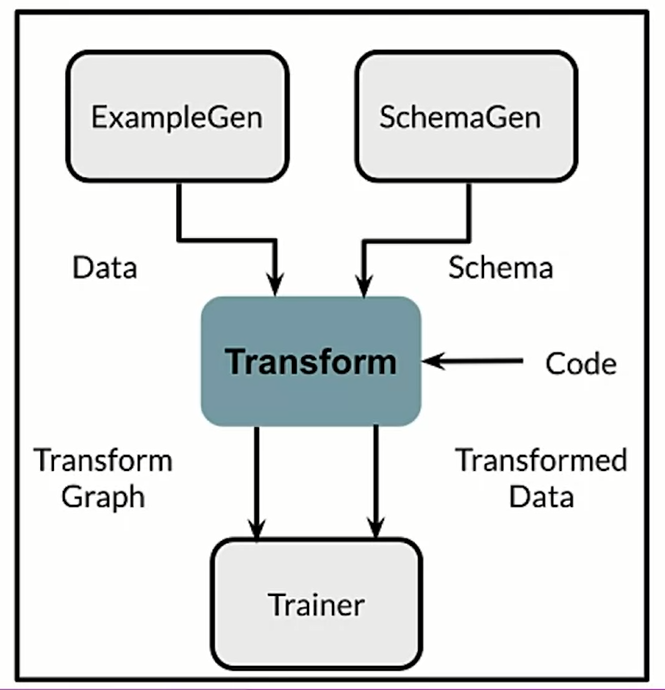
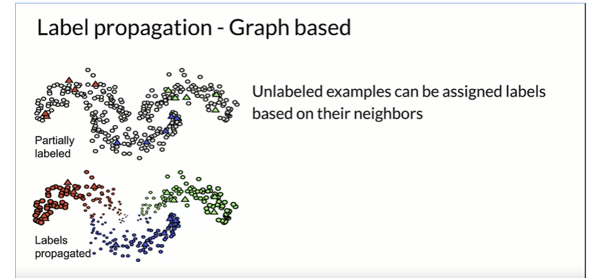

# ML Data Lifecycle
Data is the hardest part of ML and the most important piece to get right, broken data is the most common cause of problems in production ML system.

ML modeling vs production ML:

- static vs dynamic-shifting
- overall accuracy vs fat-inference, good interpretability
- optimal tuning vs continuously assess and retrain
- high accuracy model vs entire system

Managing the entire life cycle of data:

- Labelling
- Feature space coverage (same train and dev)
- Minimal dimensionality
- Fairness in particular to Rare conditions

And it most cover the modern software development requirement such as:

- Scalability
- extensibility
- Configuration
- Consistency
- Safety
- Modularity
- Testability
- Monitoring

challenged in production ML are very different from academic, we have to build integrated ML system (soft dev), it has continuously operate in production, deal with continuously changing data.

## ML Pipelines
with ML Pipelines we need the infrastructure fo automating, monitoring, and maintaining model training and deployment. 



this is a directed acyclic graph (DAG), which is a directed graph that has no cycles. they define the sequencing of the tasks to be performed based on their relationship.

the orchestrator helps with pipeline automation (airflow, argo, kubeflow) and also **TensorFlow Extended (TFX)** is an end-to-end platform for deploying production ML pipelines. 



each component is crucial to understand the data that we have, generate schema, doing preprocessing and feature engineering. Tuner and Trainer are used to train the model while the evaluate and infra validator are to evaluate the model and test that the model actual perform well.

## Collecting data
Collecting data in real world mean understading how to collect the necessary data. the importance of the **data quality** is crucial to the overall system; we will need **data pipeline**, automating the collection, ingestion and preparation;

when collecting data some key consideration are:

1. what kind of/how much data is available?
2. How often does the new data come in?
3. is it annotated? if not, how expensive is it to get it labeled?
4. translate user need into data needs
    * data needed
    * label needed

We can perform some preliminary operations such as:

1. identify data sources
2. check if they are refresh
3. consistency for values, units & data types
4. monitor outliers and errors and missing values
5. Measure data effectiveness: the intuition about data value can be misleading, *which features have predictive value and which ones do not?*.
    * **Feature engineering** helps to maximize the predictive signals
    * **Feature selection** to measure where the predictive signal is


in a more general way we can summarize the first key concepts as:

1. What kind of/how much data is available
2. What are the details and issues of your data
3. What are your predictive features
4. What are the labels you are tracking
5. What are your metrics

## Degraded model performance

In ML system the degraded model performance is a real problem; the first question is *how do we know that we have a problem?* we have two types of problem, two different way of changing: 1. slow-example drift and fast example drift. 

When dealing with gradual problems an example could be due to the data such as **trend and seasonality**, or it could be related to different distribution of the features (or relative importance of features changes); it could also due to the world changes such as style change, scope and processes changes, competitors changes and so on. 

for sudden problem we can have **data collection problem** (bad sensor/camera), bad log data, moved or disable sensor/cameras; or it could be **system problem** such as bad software update, loss of network connectivity or system down. 

detecting problems with deployed models means monitoring the models and validate data to find problems early, and if changing the ground truth you need to label new training data. 

## Process feedback and human labelling
two ways of data labelling are the process feedback and human labeling. 

process feedback is very useful, we can perform a direct labelling, such a continuous creation of training dataset; for instance the we the features from the inference requests, we labels from monitoring prediction and asking a feedback we are able to identify if our prediction was good or not. The process feedback is done using **log analysis tools** (logstash); 

an alternative is human labelling where you pay human to label new records:

- unlabeled data is collected
- human raters are recruited
- instructions tu guide raters are created
- labels are collected and conflicts are resolved.

in this case it could be very slow and there could be many dataset difficult for human labeling.

## Detecting data issue
data issue are  typically related to **drift** (changes in data over time) and **skew** (difference between two static versions like the training a serving data). the concept drift is when the labels meaning changing but not the data itself (see previous).

1. detecting schema skew: training and serving data do not conform to the same schema (changing literally the type of the data flowing in)

2. detecting distribution skew: dataset shift, changing the distribution of the data.



there is a straighforward way to detect skew detection; in the training data we collect the descriptive statistics and the schema; and later when we have serving data we calculate in the basic stats and then we compare them using validate statistics and if there are some anomalies some trigger are pulled and notification are raised. 

### TensorFlow Data Validation

TFDV helps developer understand, validate and monitor ML data at scale. it helps generate data statistics and browser visualizations, inferring the data schema; performs validity checks against schema and trying to detect training/serving skew. 

# Feature engineering
there are various technique to transform the data input to improve the quality of the model. Having a conceptual look at this using feature engineering meaning improving the model reducing the computational cost trying to combining, improving the data.

Across the ML pipelines we incorporate the data, combine the features, we tune objective function, we update the model making new features and lastly since it is a iteratively process we launch and reiterate all.

During training there is usually the entire training set, so we can use global transformation (std and use that to perform normalization) however we serve the model we have to be sure to be able to perform that trasformation as well. *During serving is important to include global property used in training!*

## Preprocessing for feature engineering
preprocessing consists transform raw data into a clean a training ready dataset. we prepare, tunes, transform and extracts/constructs features. 

One of the most important operation is the data cleansing (removing error data), then we perform feature tuning (scale and normalization), we can also perform dimensionality reduction. 

1. Mapping categorical values: for instance if we have some categorical values and example could be creating an hot encoding operations. Or a better approach could be create vocabulary

2. Empirical knowledge of data, for instance in text we can perform stemming, lemmatization, TF-IDF, n-grams embedding lookup and so on. in images we can think about clipping, resizing, cropping, blur and so on.

### Techniques

1. Feature scaling
    * Normalization and standardization
    * Bucketizing/binning

***Scaling*** means converts values from their natural range into a precise range (eg images are typically rescaled to \[-1,1]); it helps the model to converge and dealing with NaN errors during training. 

for **Normalization** the formula is:

$$X_{norm} = \frac{X-X_{min}}{X_{max}-x_{min}}$$

the normalization lives in \[0,1], it is typically good if the distribution *is not gaussian*. 

**Standardization** (z-score) is a way to scale using the standard deviation:

$$X_{std} = \frac{X-\mu}{\sigma}$$

the Standardization typically $\sim N(0,\sigma)$ the range in this case is -inf + inf (+2 means over 2 standard deviation!)

Talking about grouping we have **Bucketizing**, this technique is used for instance when we are dealing with dates we can group all the years from 1940 to 1960 into just one categorical value that will be encoded later. 

## Featuring engineering at scale



we have to care first of all at inconsistencies in feature engineering like the diverse deployments scenarios (mobile vs server vs web). There is a notion of granularity, we have to perform an **instance-level** (clipping, resizing) and a **full-pass** (minmax, standard scaling) operation. 

we can perform the feature engineering at the whole dataset or within the model (batch per batch). both of these have pros and cons. 

### TensorFlow Transform

it does training data and process it, creating also meta-data storage. Meta data are important for the lineage of the data; 



tftransform use apache beam to be able to process data in a very very fast way. Doing this operation we are using the same data in training and serving, this is very important so we are able to use the same data in serving layer. This is done saving a TFGraph. 

the tf.transform analyzers can do different operations such that scaling, bucketizing, vocabulary and also dimensionality reduction. 


```py
import tensorflow as tf
import apache_beam as beam
import apache_beam.io.iobase
import tensorflow_transform as tft
import tensorflow_transform.beam as tft_beam

def preprocessing_fn(inputs):
    for k in DENSE_FLOAT:
        outputs[key] = tft.scale_to_z_score(inputs[key])
    """
    all the operations needed
    """
    return outputs
```

the operation that we typically do are in order:

1. collect raw data
2. define metadata 
3. transform
4. generate a constant graph with the required transformation


see the notebook. Tft transform runs on apache beam which run on spark and flinn! 


```py
import tensorflow as tf
import tensorflow_transform as tft
import tensorflow_transform.beam as tft_beam
from tensorflow_transform.tf_metadata import dataset_metadata
from tensorflow_transform.tf_metadata import schema_utils
import pprint
import tempfile

# define sample data
raw_data = [
      {'x': 1, 'y': 1, 's': 'hello'},
      {'x': 2, 'y': 2, 's': 'world'},
      {'x': 3, 'y': 3, 's': 'hello'}
  ]
```

define the schema of the data with the *DatasetMetadata class*.

```py
raw_data_metadata = dataset_metadata.DatasetMetadata(
    schema_utils.schema_from_feature_spec({
        'y': tf.io.FixedLenFeature([], tf.float32),
        'x': tf.io.FixedLenFeature([], tf.float32),
        's': tf.io.FixedLenFeature([], tf.string),
    }))
```

define the process funtion:

```py
def preprocessing_fn(inputs):
    x = inputs['x']
    y = inputs['y']
    s = inputs['s']
    
    # data transformations using tft functions
    x_centered = x - tft.mean(x)
    y_normalized = tft.scale_to_0_1(y)
    s_integerized = tft.compute_and_apply_vocabulary(s)
    x_centered_times_y_normalized = (x_centered * y_normalized)
    
    # return the transformed data
    return {
        'x_centered': x_centered,
        'y_normalized': y_normalized,
        's_integerized': s_integerized,
        'x_centered_times_y_normalized': x_centered_times_y_normalized,
    }
```

apache beam flow:

```py
# Ignore the warnings
tf.get_logger().setLevel('ERROR')

# a temporary directory is needed when analyzing the data
with tft_beam.Context(temp_dir=tempfile.mkdtemp()):
    # define the pipeline using Apache Beam syntax
    transformed_dataset, transform_fn = (
        # analyze and transform the dataset using the preprocessing function
        (raw_data, raw_data_metadata) | tft_beam.AnalyzeAndTransformDataset(preprocessing_fn))

# unpack the transformed dataset
transformed_data, transformed_metadata = transformed_dataset

# print the results
print('\nRaw data:\n{}\n'.format(pprint.pformat(raw_data)))
print('Transformed data:\n{}'.format(pprint.pformat(transformed_data)))
```


## Feature selection
we try to understand which features are useful and which one are not, basically we are removing the features that do not influence the outcome (reducing the size of the feature space).

in unsupervised feature selection:
1. features.target variable relationship not considered
2. remove the redundant features (correlation with ohers)

we have different techniques:

1. **Filter methods**
We recall that correlated features are usually redundat (typically remove one), other filter are **pearson correlation**; we also have different correlation coeffieicent like kendall tau rank correlation coefficient, spearman's rank correlation coefficient.

the skLearn univariate feature selection routines:

- SelectKbest
- SelectPercentile


2. **Wrapper methods**

- Forward selection:
is and iterative, greedy method; it start with 1 feature and we evaluate model performance when adding each of the additional features, one at the time. we add next feature that gives the best performance and we go on.

- Backward elimination:
start with all features and we evaluate the model removing each of the included features, one at the time. 

3. **Embedded methods**
Its a supervised method like l1 or l2 regularization and feature importance. They are intrinsically related to the model used (ridge lasso regression). 

see notebooks.

# Data Journey and data storage
## Artifacts and the ML pipelines
They are created as the components of the ML pipeline execute, it include all of the data and objects which are produced by the pipeline components (schema model itself, metrics etc.). the **data provenance** is the chain of transofrmations that led to the creation of a particular artiicat, they are very helpful for debugging and monitoring the model. 

we can tracking different **Data versioning**, ML requires reproducibility also in term of code (git) and environment versioning (docker).

## Meta-data
Being able to interpret a model and trace back the provenance of the data is very important for ML system. ML meta-data helps to keep track of this. Every run of the pipeline produce meta-data (equivalent to logging).

considering the ML data pipeline we have data validation and then data transformation; if we have centralized repository we store the result and the output of them. we can have a metadata store. 

we can use the **ML Metadata library**, it supports multiple storage backends:

- Data entities to consider as units: **artifact, execution and context**.
- Types such as ArtifactType, ExecutionType, ContextType
- relationships: event, attribution, assoociations.

* `ArtifactType` describes an artifact's type and its properties that are stored in the metadata store. You can register these types on-the-fly with the metadata store in code, or you can load them in the store from a serialized format. Once you register a type, its definition is available throughout the lifetime of the store.
* An `Artifact` describes a specific instance of an ArtifactType, and its properties that are written to the metadata store.
* An `ExecutionType` describes a type of component or step in a workflow, and its runtime parameters.
* An `Execution` is a record of a component run or a step in an ML workflow and the runtime parameters. An execution can be thought of as an instance of an ExecutionType. Executions are recorded when you run an ML pipeline or step.
* An `Event` is a record of the relationship between artifacts and executions. When an execution happens, events record every artifact that was used by the execution, and every artifact that was produced. These records allow for lineage tracking throughout a workflow. By looking at all events, MLMD knows what executions happened and what artifacts were created as a result. MLMD can then recurse back from any artifact to all of its upstream inputs.
* A `ContextType` describes a type of conceptual group of artifacts and executions in a workflow, and its structural properties. For example: projects, pipeline runs, experiments, owners etc.
* A `Context` is an instance of a ContextType. It captures the shared information within the group. For example: project name, changelist commit id, experiment annotations etc. It has a user-defined unique name within its ContextType.
* An `Attribution` is a record of the relationship between artifacts and contexts.
* An `Association` is a record of the relationship between executions and contexts.


all the components of the pipeline are connected to the **MetadataStore**; we can create is using Sqlite or MySql.


```py
## sqlite
connection_config = metadata_store_pb2.ConnectionConfig()
connection_config.sqlite.filename_uri = "path"
connection_config.sqlite.connection_mode = 3

store = metadata_store.MetaDataStore(connection_config)

## mysql
connection_config = metadata_store_pb2.ConnectionConfig()
connection_config.mysql.host = "..."
connection_config.mysql.port = "..."
connection_config.mysql.database = "..."
connection_config.mysql.user = "..."
connection_config.mysql.password = "..."

store = metadata_store.MetaDataStore(connection_config)
```

## Advance labelling
### Semi-supervise learning
The starting situation is when you have a small pool human labeled data. the propagations of the labels to the unlabelled data id done computing some "similarity" ora "community structure".

there are many way to perform this operation such as label propagation graph based



### Active learning
we select the points to be labeled that would be most informative for model training. we select labels that will best help the model to train. we start we unlabeled pool data and we active learning sample trough a human annotator and label the most useful training data. 

how do we do intelligent sampling? with active learning we choose the new observation that are most uncertain. 