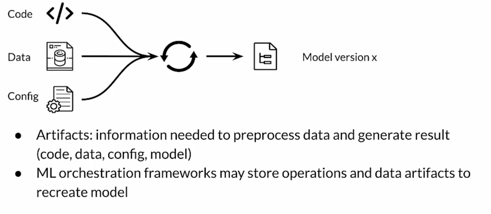

# ML Deployment
Ml serving means make your model available to end user, when doing this operation we have to care about 3 key concepts: the model, an interpreter and the input data; 

the importance metrics to be considered when deploying a model are: latency (delay between user action and response), cost, throughput (number of successful requests served per uni time eg call x secs). 

as model become more complex the resource required increase (GPU, TPU, model registry and so on); finding the right balance between cost and complexity is the way. we have two way to evaluate a model: the first is the **model's metric** such as the accuracy, precision, MSE and we also have to consider the satisfying **gating metric** such as the latency, the model size and the GPU load.

One factor is the use of accelerator, **GPU** tend to be optimized for parallel throughput while **TPU** are optimized for complex models and large batches.

To deal with latency a good solution is to use NoSQL database for caching data such as Redis, Google Cloud MemoryStore, google cloud Firestore, amazon dynamoDB. 

The deployment when there are simple application could be a web app in which the users make requests via web application, the model is wrapped as API service (FastAPI, django, flask). Alternatives are Clipper which is an open.source from UC berkeley or TensorFlow Serving. 

There are many advantages of serving with a managed service for instance realtime endpoint for low-latency predictions, scale automatically based on traffic, use GPU/TPU for faster predictions. Example of [Google cloud AI platform](https://github.com/https-deeplearning-ai/machine-learning-engineering-for-production-public/blob/main/course4/week1-ungraded-labs/C4_W1_Optional_Lab_1_XGBoost_CAIP/C4_W1_Optional_Lab_1.md)

## TensorFlow serving 
the easiest way is using docker:

```bash
docker pull tensorflow/serving:latest-gpu
```

there is also an available Binaries called *tensorflow-model-server*. 

## Model serving architecture

We can perform two choice: **On prem** vs **On Cloud**. Typically large companies use on prem option while on cloud is prefered by small companies. In the first case you have to manually download and maintain when deploying on cloud you can use Virtual Machine and deploy on their infrastructure (and use provided ML workflow).

the high level architecture of a model is as follow: **model file** that is read by the **model server** that provide an API  to use it (REST or gRPC). some of the most popular model servers are:

- [TensorFLow serving](https://www.tensorflow.org/tfx/serving/architecture)
- [TorchServe](https://github.com/pytorch/serve)
- [KubeFlow Serving](https://www.kubeflow.org/docs/external-add-ons/serving/)
- Nvidia Triton Inference Server

looking at the more in details TensorFlow serving it provides and and real-time inference system, multi-model serving (A-B testing and so on)and exposes a gRPC and REST endpoints. 

{width=200}

Example with DOCKER and FASTAPI ( [Guide](https://github.com/https-deeplearning-ai/machine-learning-engineering-for-production-public/tree/main/course4/week2-ungraded-labs/C4_W2_Lab_1_FastAPI_Docker))


## Scaling infrastructure
There are two way to scale: vertical scaling (more RAM, GPU, increased power) or **horizontal scaling** (adding more device). cloud computing is useful since it allow to scale horizontally when needed and immediately scale down when finished. When choosing look if there is the possibility to manually scale, auto scaling, latency and cost of the platform. 

when scaling horizontally there are a lot of problems related to the configuration/access/permission and son on. one solution to this problem is to use Virtual Machines. Containers are quite similar to VM but they do not require operating systems! one of the best solution is to use Docker management containers.


containers offer convenient way to scaling horizzontaly but there are some problems as well, like any app in a containers could go down. We want to be able to switch the traffic so the application never goes off.

The idea of **orchestration** is that having a set of tools that handle the life cycle of containers managers.


two of the mnost pupular container orchestration tools are **Kubernetes** and **docker swarm**. when using kubernetes Kubeflow is the choice.

(https://github.com/https-deeplearning-ai/machine-learning-engineering-for-production-public/tree/main/course4/week2-ungraded-labs/C4_W2_Lab_2_Intro_to_Kubernetes)

## Data Processing and Inference
### Online inference
If there are some popular products you can cache them and retrieve it faster than other requests. this type of cache is used with NoSQL database such as DynamoDB Redis and so on. 

test the latency using [locust](https://locust.io/),  ( [GUIDE](https://github.com/https-deeplearning-ai/machine-learning-engineering-for-production-public/tree/main/course4/week2-ungraded-labs/C4_W2_Lab_3_Latency_Test_Compose) )

### Data preprocessing
the models deal with pre-process data and that must be done somewhere. when preprocessing we have to deal with:

- data cleansing (invalid data)
- feature tuning (normalization, clipping outliers, missing values)
- feature construction (combine inputs if needed)
- represent transformation (one-hot encoding, vectorization, ...)
- feature selection

we have two tools that really help perform this operation at scale: [**apache Beam**](https://beam.apache.org/get-started/try-apache-beam/) and **tf transform**.

## Experiment Tracking
We need reproducible products and tools that allow to create ML system that are reliable and reproducible. What does it mean to track experiments? 

- Enable you to duplicate a result (parameters, dataset, model version)
- Enable you to meaningfully compare experiments
- Manage code/data versions, hyperparameters, environment, metrics.
- Organize them in a meaningful way.

simple experiments are done with notebooks, however code is usually not promoted to production. There are some tools for managing notebook code such as nbconvert (.ipynb to .py), jupytext, neptune-notebooks.

As you perform experiments you have to tracking runtime parameters, the simples way is to use config files declaring the metric, learning rate and so on. as well with the parameters you also should perform **data versioning**; there are good tools for data versioning such as **Neptune**, git LFS, pachyderm and so on. 

TensorBoard could be a tools for logging results or [**neptune.ai**](https://neptune.ai/product#what-is-metadata-store) vs **MLFLOW** vs **WANDB**.

## ML Solution lifecycle
**CI / CD / CT / CM**:

- Continuous integration
- Continuous delivery
- Continuous training
- Continuous monitoring

### MLOPS level 0
the level of automation of ML Pipelines determines the maturity of the MLops process, the goal is to automate trining and deployment of ML models into the core softwares system, providing consistent monitoring. The level 0 is the **manual process**, including the EDA, the preparation, training and evaluation (*Experimental Code*). 

in this manual process we have a less frequent releases, few CI/CD. there are many challenge in MLOps level 0:

- Need for actively monitoring the quality of your model in production
- Retraining your production models with new data
- Continuously experimenting with new implementations to improve the data and model.

### MLOPS level 1-2
we have some sort of orchestrated experiment, there is a need to repeated experiment. The transition between steps are orchestrated; we need reusable, composable, and shareable components. When some triggers is pulled to pipeline is called and the new model is created and replace the previous. 


[Guide](https://neptune.ai/blog/mlops)

### ML Model versioning
Each model version can have different data, parameters and results, here ML models is used. In software deveoper we have 3 different type of version:

- **Major**: contains incompatible API changes
- **Minor**: adds functionality in a backward compatible manner
- **Patch**: makes backwards compatible bug fixes

in ML there is no defined ways, a possible approach consists of:

- **Major**: incompatibility in data or target variable
- **Minor**: model performance is improved
- **Pipeline**: pipeline of model training is changed

### Model Lineage
is a set of relationship that lead to the model version researched. 



model registry contains all the possible lineage: 


in the registry are recorded as well as meta data such as the model versions, the model serialized artifacts, free text annotations and links to other ML artifact and metadata stores. 

Some good tools for ML registry are: Azure Ml model registry, SAS Model Manager, MLflow model registry, Google AI platform, Algorithmia. 

[GUIDE](https://neptune.ai/blog/machine-learning-model-management)

### Continous Delivery
it could be very useful tu use unittest and github! each time a new model is deployed all the test are runned and if there is some problems the operation is not completed. The main test are **Unit testint**, you can control that each component in the pipeline produces exteped artificat.

For input data is concerne that the feature engineering are correct, like test values, type values, test format ahd so forth. For the model it must be seen in a modular way as well, controlling for NaN, empty strings, shapes, accuracy and various metric. 

You should cover edge and corners cases!