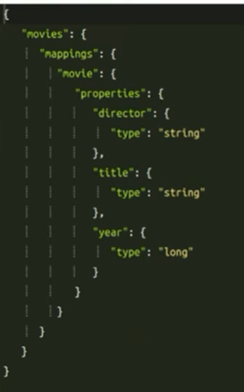

# ElasticSearch Introduction
**ElasticSearch** viene spesso considerato come un motore di ricerca ma è più semplicemente un **DB NoSQL** in particolare un **Document-DB** che tratta i dati in JSON format. Kibana è uno strumento ulteriore per fare visualizzazione dei dati.

ElasticSearch permette RestFul API per qualunque cosa:

```bash
Get /_status #information on the cluster
Get /_nodes #information on the node
```

## CRUD operation
we can perform CRUD operation on our DB as follow:

```bash
PUT /movies/movie/1
{
    "title":"the goodather",
    "year": 1992
}
```

l'impostazione è su autoindex. la prima volta che ingerite un record su un indice mai visto fino ad ora ElasticSearch crea l'indice nuovo se non viene trovato. quindi l'indice movie verrà creato. 

## Mapping
Ogni volta che un indice viene creato viene effettauto un **mapping**: in sostanza elasticsearch si presenta come schemaless ma nel momento in cui vengono inserite i dati il sistema in automatico lo crea.


```bash
GET /movies/movie/_mapping #torna il mapping creato dai dati inseriti
```



è dunque importante caricare i dati direttamente nel formato corretto.
qual'ora vengono inseriti nuovi dati come nel caso:

```bash
PUT /movies/movie/1
{
    title: "the godfather",
    genres: ["crime"]
}
```

in questo caso abbiamo *aggiunto genres nel mapping* e aggiunto un nuovo records.

## Update
un update puntuale di un campo:

```bash
POST /movies/movie/1/_update

{
    "script": "ctx._source.genres += g"
    "params": {
        "g":"Drama"
    }
}
```

## 404
il 404 in elastichserach

```bash
GET /movies/..

{   "_index":"movies",
    "found":false
}
```

## Search API
### match_all
```bash
POST /movies/_search
{
    "query":{
        "match_all":{}
    }
}
```

l'indice non ha alcun senso a livello di sort, può essere che torni prima l'indice 5 poi l'1.

I documenti che tornano sono sortati a seconda che matchanano più o meno la query richiesta. 

### query_string
```bash
POST /movies/_search
{
    "query":{
        "query_string":{
            "query": "kill"
        }
    }
}
```
ovunque compare kill nel titolo, o in qualunque altro campo te lo torna. 

```bash
POST /movies/_search
{
    "query":{
        "query_string":{
            "query": "ford",
            "fields": ["title","director^10"]
        }
    }
}
```
in questo secondo case deve esserci la stringa ford nel titolo e in director ma oltre tutto stiamo dicendo che se la stringa è presente nel director allora lo score di tale query è 10 volte tanto.

### filtered and filter

```bash
POST /movies/_search
{
    "query":{
        "filtered":{
            "query":{
                "match_all":{}
            }
        },

        "filter":{
            "range":{
                "year":{
                    "gte":1962, #greater than equal gte
                    "lt":2000 #and less than 2000
                }
            }
            # "term":{"yaer":1992} #return only where the term is 1992
        }
}
```

### Filter with term
```bash
POST /movies/_search
{
    "query":{
        "filtered":{
            "query":{
                "match_all":{}
            }
        },
        "filter":{
            "term":{
                "director": "francis ford coppola"
            }
        }
    }
}
```

In questo caso abbiamo un problema dobuto agli elastic serach analyzers, sono composti da tokenizer a da zero o più token filters. quando viene ingerita una stringa, se viene analizzato (anche nella query string in alcuni casi sarà analyzed e in altri no). 

un token per elasticsearch è una singola parola (tagliate parole etc etc), i token filter sono operazioni che scartano le stopwords che permettano query più efficaci.

