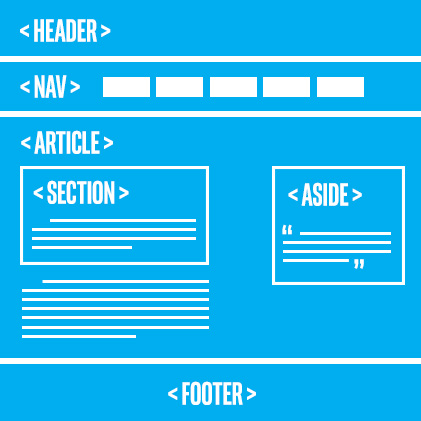
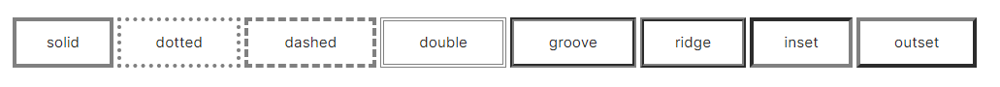

# General introduction

- HTML5

When people say 'HTML5', they usually mean a bit more than just the 5th version of the "HyperText Markup Language". Modern Web pages and Web applications are generally composed of at least three components, so what people often mean when they say 'HTML5' is the trio of languages: HTML5, CSS3 and JavaScript.
The 'HTML' part contains all the content, organized into a logical structure.  This is the part that an author might be most concerned with: the words, chapter headings, figures, diagrams, etc.

- CSS

The 'CSS' part (version 3 being current) is all about the presentation or style of the page; what it looks like without too much regard for the specific content.

- JavaScript

The 'JavaScript', or 'JS' for short, part is about the actions a page can take such as interaction with the user, and customizing and changing the page according to any number of parameters.  This is what allows a Web page to be more than just a document, but potentially a Web application, with nearly unlimited possibilities. 

## Elements, tags and attributes

So the "M" in HTML stands for "Markup", but what does Markup really mean? Essentially, it means to annotate a document with extra information. Things like where different sections and paragraphs begin and end, which part is the title, which things should be emphasized and so on. There are many ways to markup a document, but HTML borrows a technique from an ancestor language, SGML (Standard Generalized Markup Language), which uses angle brackets ("<" and ">") to separate the annotations from the regular text.  In HTML these annotations are called "tags".

## meta tag

Use the \<meta> tag with the charset attribute in your HTML page to indicate to the browser the character encoding you will be using in the page. 

- \<meta charset="utf-8">

shift-alt-f or k

## How to use character references
All HTML character references can be written using either a name or number. 

If you want to use a named character reference in your source code, use an ampersand symbol '&', followed by the name and a semi-colon. Names are case sensitive. For example, the following represents a no-break space:

- \&nbsp;

There are two types of numeric character reference: ones that use decimal numbers and ones that use hexadecimal numbers.  In each case, the number represents the code point number of the character in Unicode.

If you are using a decimal number, use an ampersand symbol '&' , followed by the symbol '#', then a decimal number and a semi-colon.

- \&#160;

If you are using a hexadecimal number, use an ampersand symbol '&' , followed by the symbols '#x', then a hexadecimal number and a semi-colon.

- \&#x00A0;

While it might be tempting to not use one of these character references when you notice that the browser produces the expected result anyway, it is a best practice to use character references for these five special characters using \&lt;, \&gt;, \&quot;, \&amp; and \&nbsp; at all times.  This is because you can never be sure what browser or application will be used to view your code, and how that will behave..

## White space and capitalization

- Tags are case insensitive
- Attributes are case sensitive

## More on tags

- \<q>

The q tag is for quotes.  This tag has no relationship to the somewhat confusing single and double quote characters, rather it's used when you want to quote a person or written work in your Web page. Quotes are customarily displayed using quotation marks. Thus <q>Brevity is beautiful</q> would be rendered as Brevity is beautiful.

- \<blockquote>

If you want to quote a larger passage, you may want to use blockquote, which will typically set the quoted text apart from the surrounding text and indent it, to make clear that it is quoted text:

- \<hr>

 The hr tag stands for horizontal rule and is used to insert a horizontal line across the width of the text, or a thematic break in an HTML page to divide or separate document sections. The \<hr> tag is an empty tag and does not require an end tag. It would typically look like this:<hr> <br/>

- \<pre>

pre stands for "PREformatted text", meaning that the text is to be presented exactly as written in the HTML file. It preserves all text formatting characters i.e. spaces, line breaks and (thus bypassing the white space rule) and most typically implies a monospace font. It is very handy for illustrating bits of program code, or other "typewritten" material

# Attributes, images and<> links

Attributes are used in tags to further define the tag:

It is used inside the opening tag it is applied to and should be added after a space from the tag name: \<ol start="5">. The start attribute is used inside the \<ol> tag. 

- Attributes are a name-value pair: start="5"
name: start
value: any positive integer

- The only exception to the name-value pair is if the attribute is a 'boolean attribute'. These attributes have only two types of values - true or false. **But instead of writing "true" or "false" for its value, you add the attribute name to indicate true and omit it to indicate false.** An example is the 'reversed' attribute in an ordered list \<ol>. Adding this attribute is an indication that the list order should be reversed (in descending order). \<ol reversed></ol>

## Global & non Global attributes

Global attributes can be applied to all tags. They are common attributes. Examples of global attributes are id and class. There are many more global attributes. Here is a list of all the global attributes and the values they accept.

Non-global attributes are attributes applied to a specific instance of a tag. It can be applied to one or more tags. For example, start is an attribute for the \<ol> tag and it cannot be applied on the \<p> or \<h1> tags, it is specific to only ordered lists \<ol>. Another attribute specific to the \<ol> tag is reversed, which we learned in the last unit as an example of a boolean attribute. The non-global attribute width can be applied to several tags such as \, \<input> and \<video>.

## Title & Alt

Be it a paragraph, header, image or any element, the title attribute is used to provide additional information about it. It is very useful, to elaborate on abbreviations or add some context. For images, you should use an alt attribute as there is no guarantee that the title attribute will be presented to assistive technology users.

# Web page structure

## Semantic Elements

Let's look at a typical Web page structure that consists of blocks named after: header, nav, article, section, aside and footer.



Tags such as \<article>, \<section>, \<header>, \<nav> and \<footer> were specifically introduced in HTML5 to define the Web page structure. These new semantic elements give meaning to different parts of a webpage. When you do a Google search, the search engine automatically processes millions of HTML pages to scan and offer you the most appropriate content.

Each section refers to a part of the document:

- The header 

can be a starting point for the whole document or individual sections. Introduction for the whole page or individual sections, article, nav, aside elements. Typically contains site name, logo, navigation. Does not have to be at the beginning of page.

- The nav 

refers to navigation. It could contain a set of navigation links, such as a table of contents of a book. A page can have more than one \<nav> element like table of contents, horizontal navigation in header and footer navigation.

- The section 

refers to sections in a document. For example, a document about plants could contain several sections under headings such as perennials, annuals, soil type, etc. Navigation links for the document. Defines sections in the document such as chapters, headers, etc. Typically used on content that cannot make sense on its own. 

- The aside 

refers to content that is apart from the main content. For example, in an article about a young architect from the Umbria region of Italy. The aside might be a small sidebar with information about Umbria, things like geographical details and population. Side content other than main content, like a sidebar. These are not considered as part of the main page outline.


- The article 

refers to independent content. If an article is extracted out of the document, it should make sense all by itself. Articles, blog posts, frequently asked questions (FAQ) are all examples of independent content. 	Defines independent content that should make sense on its own outside of the document such as newspaper articles, blog posts, etc.

- The footer 

contains typical footer information such as authoring, copyrights and contact information. Includes typical footer information like authoring, copyrights, contact information and a footer menu.

- \<main> ...

The use of these semantic elements improves the automated processing of documents. When it scans a \<nav> tag, it automatically knows it includes content related to page navigation or a header indicates introductory content. It provides the structure and consistent behavior across many webpages providing simpler and more direct information to browsers making life easier for them. It also improves the accessibility of webpages. Assistive technologies depend on the structure of the document to present information to the users. If a screen reader can correctly determine the structure of a document, it reads the document more seamlessly and avoids irrelevant information or repeating content. 

## Others semantic elements

- \<details> element


The \<details> tag is very cool. It is used in conjunction with a nested \<summary> tag and some other content. The result is that the summary is shown with a disclosure triangle alongside it, and the other content is initially hidden.  By clicking the triangle, the other content is displayed to the user. This requires no JavaScript and is a simple way to get a powerful and desirable feature.

Below we see the HTML, and you can try it out for yourself! Note that the \<details> tag works in most Web browsers.

<details>
<summary>Nice hidden features!</summary>
<p>Very nice features!!!</p>
</details>

<hr><br/>

- \<figcaption>

This element is used to provide a caption or explanation of the image (figure). While the alt attribute explains the image for assistive technology, <figcaption> can be used to provide additional information for all users.

- \<mark>

This element is used to specify content that you want to <mark>highlight</mark>. 

## When to use what
Now, you have learned the semantic elements available and their syntax. When you try to apply it practically, there are some common problems you might run into. For example, when do we use \<header> and when do we use \<h1> to \<h6> tags? Can I use semantic elements like \<header>, \<footer> and \<nav> multiple times in my Web page? Or a more frequent question, do I use \<article>, \<section> or \<div>?

Fear not. We will discuss these scenarios in detail so you can be better equipped to apply semantic elements in your Web page. 

- \<header> vs \<h1> - \<h6>

\<header> is simply an area to add any introductory content about your page. It can contains headings, paragraphs, tables, images, logos and even navigation. \<h1> to \<h6> are headings we learned early on in the course. \<h1> is for the most important heading and \<h6> is for the least important. Let's see an example of how to use the \<header> and \<h1> to \<h6> tags in your Web page.

- Can you have more than one \<header>, \<footer> and \<nav>?

There is a common misconception that a Web page can only have one header at the start, one footer at the end and one main navigation section to maneuver the site. 

- Multiple headers & footers


Header and footer elements are for the parent element (section, article, division or body) that they are used in. If you have multiple sections or articles, then you can have one header and footer for each.

- Global header & footer


Header and footer elements can also be used site-wide at the top and bottom of the body of the Web page. This type of header will typically contain logos, main heading, a search area and site-wide navigation and the footer will typically include authoring information, references and other links, copyright information etc.

## \<div>

The \<div> tag is one you will likely see sprinkled all over an HTML document.  \<div>, as the Content Division element, is used to define a division or a section of the document. Div is not a semantic element, however, it is commonly used when there isn't a better semantic sectioning element to use.

It is like a generic container that can hold a variety of elements such as paragraphs, images, links, tables, etc. It can be used to group elements for styling purposes. You can do this by assigning an id or class attribute to the div element and then applying styles which will affect all elements in the div container.

## \<span>

While we are on the topic of the\ <div> tag and semantic elements, one more important element that comes in handy is \<span>. Span and Div are so similar yet so different that there is an entire wikipedia page dedicated to it.

When can \<span> be used?
- when adding styling to part of a sentence (inline),
- when manipulating part of a sentence using JavaScript,
- When there isn't a more appropriate HTML element that applies, you can use \<span> (and \<div>) to add attributes such as class and id

Like \<div>, \<span> is not a semantic element. You should only use \<span> if no other semantic element is appropriate. \<div> and \<span> serve the same purpose but should be applied at different levels. **\<div> is a block level element (for a block of space) while \<span> is an inline element (for within a line or phrase).**

## Why two paragraph tags don't work
In the first \<span> example, we said that nesting two paragraph elements was invalid HTML.

\<p>Hi everyone! My name is Alexa and I work for \<p class="company">ABC Company\</p>\</p>
After reading an opening tag \<p>, if the browser sees another \<p> or any other block level element including \<div>, it will automatically close the first open \<p> for you. Nesting one paragraph tag in another is not valid because the browser will consider them as two paragraphs one after the other. Even though you close the paragraphs with two closing tags \</p>\</p> at the end, they are ignored.

# Images

- Image: 'src' attribute

The source attribute from the \ tag tells us where to fetch the image from. There are two different types of URLs you can give for source. 

1)  Path to an image file within your Web site: \

2) Path to an image file that resides elsewhere on the Web: \

<hr>

- Image data

most images, especially JPEG, contain a lot more data than is needed for a browser and are too often overly large and slow.  You can reduce the size of the image using photo editing software that allows you to re-sample an image to reduce its pixel data and in turn reducing image size. However, once you re-sample an image, do not make change its size (height and width) to make it larger as it will become pixelated and blurry.

- JPEG (Joint Photographic Experts Group) 

jpeg images compress well and are the standard for photos. But they don’t support any sort of animation or transparency.

- PNG (Portable Network Graphics) 

png images support transparency and alpha channels. This makes them useful for non-rectangular images that may need to overlay different background colors or other elements on the page. To make PNG images, a user would need graphics editing software (like GIMP, Photoshop, or others). 

- SVG (Scalable Vector Graphics) 

svg are defined mathematically and support animation. Also, since they are defined mathematically  they scale to Logo Scalable Vector Graphics (SVG)any size without worrying about pixels, resolution or image data. This makes SVG images an excellent format to use, if possible. SVG is great for charts, graphs, maps, geometric shapes, and line based illustrations.  

## <em>Alt</em> and other attributes
<br>

- alt 

alt stands for alternate text for an image. Importance of the 'alt' attribute
If you add alt to your image, screen readers will typically announce that there is an image and read out the contents of the alt attribute.
Your image will not display if the path in your source attribute is wrong, if you have a slow internet connection, or if the image has been relocated or renamed. It will show a broken link. It is useful to have the alternate text display so the user can make sense of the missing image.
Search engines do not 'see' images. They rely on the alt attribute to find out what the image is about. If you use your target keyword in alt, it will optimize the search.
To consume less data, some mobile users turn off images. They need the alt attribute to find out what the image is about.

If the image is purely for presentation or decoration purposes, you should leave alt empty - \. Assistive technology will then ignore this content.

- title 

The alt attribute is meant to be an alternate source of information while the title attribute should provide additional information about the image. 
Note: For images, you must use an alt attribute as there is no guarantee that the title attribute is presented to assistive technology users. The title attribute should not be relied upon for important information, and it should not be used in place of the alt attribute.

- height & width attributes


# Hyperlink

A hyperlink is any text or image that takes you to another place. 

- Anchor element

The hyperlink tag in html is simply \<a>, and it is called the anchor element. Here is how it is used. States of a hyperlink
If the link has not been clicked, it will be blue and underlined. Now, click on the link and you will see that a visited link looks purple and underlined. Apart from unvisited and visited links, there is also a status called active link. A link becomes active while the user is clicking on it. During this time, the link will be red and underlined.

- Unvisited: blue + underlined
- Visited: purple + underlined
- Active: red + underlined

```
<!-- Text in a hyperlink-->
<a href="https://www.qwant.com/">If you click on me, I will take you to qwant.com</a>

<!-- Paragraph in a hyperlink-->
<a href="https://www.qwant.com/"><p>If you click on me, I will take you to qwant.com</p></a>

<!-- Image in a hyperlink-->
<a href="https://www.qwant.com/"></a>

<!-- Section-->
<a href="#idName">important section</a>
```

## href attribute

The only attribute we have seen thus far in this chapter of hyperlinks is href. 
href points to the URL that the link should jump to. Though it is an optional attribute, without it, the \<a> tag will not be a hyperlink because it obviously has no idea where to jump to.

You can use it to jump to another website, to another page of your website or even if at some section on the same page such as:

he element, is referenced using its ID. E.g. If you want to link to a div with id='details', the corresponding anchor tag will be: \<a href="#details"></a>

## target attribute !
target specifies the destination where the linked URL in href should be opened. It can take a variety of different values, but for our purposes we'll focus on the two below.

- In the same view where the link resides. If no target is specified, this is the default behavior &#8594; _self  &#8594; \<a href="https://qwant.com/" target="_self"></a>

- In a new window or tab. This is very convenient if you want to link the user to a Web page without having the current page disappear. By clicking on the previous window or tab, they can redirect to the page where the link is. &#8594; _blank  &#8594; \<a href="https://qwant.com/" target="_blank"></a>

## media attribute

The media attribute was introduced in HTML5. We will look at it briefly here. It is used to specify what kind of media or device the URL you linked to in href is optimized for. The URL could be targeted for special devices like projectors, speech synthesizers or pages meant to be printed. It is useful if you want to cater your target document that the URL points to a particular device type.

Imagine you have a page scattered with multiple images and you want to display this page on a handheld device. Handheld devices are known to have small screens and limited bandwidth. We want to align the page better for a small screen and reduce the size of images. So the media attribute allows us to tell the anchor element that this page is targeted for handheld devices. You do this by providing a value for the attribute.

## download attribute

The download attribute is also new in HTML5 and it makes a link download a file instead of navigate to another location. It takes in the filename as value but the value is optional. So the download attribute can be specified in the following ways:

```
<a href="/assets/hello.txt" download>
<a href="/assets/hello.txt" download="new-name-for-text-file">
```

If you do not specify a value for download, it will download the file with name unchanged. Else it will download the file with file name modified according to value specified. 

<br/>


# CSS Basics (just the tricky one)

- The \<style> tag


The best practice when working with CSS is to keep it in an external file using the \<link> tag, however, when starting, it is simpler to merely place it directly into the document under edit.  

To place CSS directly into an HTML document, we use the \<style> tag.  This tag can appear anywhere in an HTML document, however, the most common practice is to place it in the \<head>.

Simply put your CSS into a separate file. This file does not need any HTML markup (i.e., no \<style> tag required).  Use the .css file extension and use a \<link> tag to bind it in. The \<link> tag must appear in the \<head> section.  **By convention, css files are kept in a directory named css.**

- \<link rel='stylesheet' href='css/mycss.css'>

<br/>

# Units

- px

'px' is short for 'pixel', which is a single dot on the screen.   So text with  font-size:20px   is 20 pixels tall on-screen. In actuality, due to browser zooming, retina displays, or other factors, this may or may not match to 20 physical on-screen pixels. px are useful for both horizontal and vertical dimensions. 

- em 

'em' is a typographic term that has come to the Web. On the Web, em units are usually used for vertical dimensions.  One 'em' maps to the height of one capital letter in the parent context.   

```
li { font-size: 0.9em; }  /* text in a list item is smaller than its parents */
h1 { font-size: 1.2em; }  /* but an h1 will be bigger than the parent */
i  { font-size: 0.5em; }  /* and any italicized text will be half as big. */
```

- rem 

'rem' is much like 'em', **except that 'em' sizes an element relative to its parent, and 'rem' always derives its size relative to the root.**  In an HTML document with lots of nested elements, 'rem' will generally prove to be more reliable than 'em'.  'rem' is supported in all modern day browsers, including mobile, but not older ones. 

Note: to ensure you are setting the root size, use both the html and body selectors.

```
html, body { font-size: 20px; } 
```

- %

Whereas em is a measure relative to the parents text size, the percentage unit (%) is relative to the parent dimension.  This is a useful unit for both horizontal and vertical dimensions, though often more useful in the horizontal. Initially, the percentage unit may seem very handy (and it is), and many developers fall in love with it. But the love affair is usually short lived. One of the limitations of this rule is that for it to work correctly, the parent must have an explicit width or height set. This limitation is particularly noticeable in the vertical dimension. If the parent element doesn't have an explicit height set then child percentages may be percentages of 0. 

- <mark>_ vh / vw _</mark>

'vh' stands for viewport height, and 'vw' for viewport width.  The vh and vw units work much like the percentage ( % ) unit. But instead of percentage of the parent, it is percentage of the screen (aka viewport).  Obviously, vh is for vertical dimensions, and vw for horizontal dimensions.

vh and vw do not suffer the parent limitation that the % unit does.  Most modern browsers support these units, but there are some exceptions on older mobile browsers. 

```
p { 
  margin-left:  10vw;
  margin-right: 10vw;  /* 10% of screen width will be spent on the two side margins */
 }
 ```

 ## Styling a List

 - list-style-type

list-style-type governs the little list marker that is usually positioned to the left of any list item.  For un-ordered lists (\<ul>), there are several popular values: disc, circle, square, and none.

```
li { list-style-type: disc; }
```

For ordered lists (\<ol>) you can choose different ways of having the numbers shown: decimal, decimal-leading-zero, lower-roman, upper-roman, lower-alpha, upper-alpha, as well as several of the worlds languages: armenian, georgian, simp-chinese-formal, and many others. 

```
li { list-style-type: lower-roman; }
```

- list-style-position

Besides choosing the type of marker applied to each list item, you may also want to govern how closely it is positioned to the list itself. The list-style-position property handles that.  The two values are inside and outside.  They govern whether the markers are positioned inside the box of the list, or outside. This is most evident if a border or background or similar is applied to the list. Below, we have put a blue border on the list. 

```
li { list-style-position: inside; }
```

# Combining selectors

- Comma separated selectors


Let's say we want to make all our \<blockquote> tags, \<q> tags, and anything with "speech" in it's class string, to be red italic text.  How might we do that?  We could make three separate rule sets.  Or, better, we can separate our selectors with commas (,) before one rule set.  **if some element needs an extra property is possible to define it as:**

```
blockquote,
q,
.speech {
   color: red;
   font-style: italic;   
}

.speech { font-weight: bold; }
```

- Specialized selectors

If two selectors of different types (like tag and class) appear next to each other with no spacing separating them, then they form a specialized selector. To match, a candidate must match both rules.  If a tag selector is used, it must appear first.

This is most useful with class and tag selectors, like so:

```
blockquote.speech { font-color: green; }
```

In the example above, the blockquote.speech selector is a blockquote tag selector combined with a .speech class selector.  So this rule will not necessarily apply to every blockquote, nor every element with the speech class. Instead, it will only apply to those blockquotes that also have the speech class.

It isn't unusual to see multiple classes joined this way as well:

```
<li class="insect flying">moth</li>

.insect.flying { text-decoration: underline; font-weight:bold; }
```

- Descendant selectors

In the following HTML, we see some paragraphs that have some links (\<a>) inside. The link tags are inside the paragraphs, but not necessarily direct children.  

```
#intro a { color: red; }
#guideline a { color: #00FF00; }
```

- Direct descendant selectors ( > )

Sometimes you don't want to apply a style to any _possible_ child, but to only to the direct children.  This can be done with the > symbol.  Use it between selectors to limit the application to the direct children of the parent. For example, this rule, if applied to the HTML of the previous selector, would cause the links in the intro section to be larger, but not the links in any nested quotes or blockquotes. :

```
#intro > a { font-size: large; }
```

## Inheritance

Inheritance can be explicitly leveraged. Many CSS properties accept the value of inherit, which means to inherit the value from the parent. By smartly leveraging inherit, you can reduce repetition in your CSS rules and make your project easier to maintain. 

In the sample below, we see a paragraph with children and grand-children. A CSS rule is applied to the paragraph that sets the font-family to be monospace, and the padding is set to 40 pixels.  Note that in the result, the font-family is applied to all the children, while the padding is only applied to the paragraph itself, none of its children inherit the padding.

```
p { 
  /* inherited by children of p */
  font-family: monospace;  
  
  /* not inherited */ 
  padding: 40px;          
}

span, q {
  padding: inherit; 
 }
```

 However, generally, the properties associated with positioning and layout are not inherited.  **Likewise, the decorative properties (borders, background images, etc.) do not inherit.** Most properties that begin with text- or font- inherit.

 ## Table \<table>

 - \<tr>

Creates a table row. it has two important attributes:
**colspan** which specifies the number of cells you want that column to span (cover) and the **rowspan**	which secifies the number of cells you want the row to span (cover)


- \<th>

There are two types of cells in a table - header and standard. \<th> creates table header cells. The content of table header cells is bold and centered by default. 

- \<td>

The \<td> element defines a cell of a table that contains data. Content of table data cells is left-aligned by default.

Similar to an HTML document, a table in HTML can be split into header, body and footer. We use these three elements - \<thead>, \<tbody> and \<tfoot> - to specify parts of a table.

It is very useful to define parts of a table as header, body and footer because once browsers are able to identify which cells are header and footer, the body can be allowed to scroll independently of header and footer catering to a good table viewing experience in small screens. 

styling tables:

- border

 border is best specified in CSS. It is a shorthand property meaning you can set several CSS properties simultaneously. 

- border-collapse

We gave a border to the table, table header and table data above. This creates two borders creating a double line. In order to collapse them all into a single border, we use the border-collapse CSS property.
- border-collpase options:
  - separate - default value where borders are detached like in the example above
  - collapse - borders are collapsed into a single border
  - initial - sets to default value (separate)

<br> 
- Table width and height

Browsers automatically set the widths and heights of the rows and columns of your table, according to the cells' contents. Cells containing the most content usually set the heights and widths of all their adjacent cells.

- text-align

This property is used to align the text of <th> and <td> cells left, right or center.

- vertical-align

This property is used to align the text of <th> and <td> cells: top, bottom or middle.

- border-spacing

The border-spacing property specifies the distance between cells' borders. This is different from padding (which is space inside a cell's border). Its value is specified in units of length like px, em, cm and % (relative to parent container's width).

- Side borders

The simple border property will set the border to all four sides of a table element. You can also set borders to individual sides - top, right, bottom, left -.

- zebra table

A zebra table has alternating colors for table rows making it easier to differentiate data between rows. You can specify which rows you want to differentiate using a different color. Typically, you apply this property to a set of even and/or odd table rows to created a striped effect.

```
tr:nth-child(even) { background-color: grey; }
tr:nth-child(odd) { background-color: #ccff99; }
```

- hover to highlight

Using the hover property on your <tr>, you can specify that any table row that your user points at, is highlighted, in the color you specify.

- overflow

With padding, additional columns and rows, your table can easily grow rather big overflowing out of the <div> you had planned for your table in your Web page. You can use the CSS overflow property to resolve this. It has four values other than initial (that sets the default value) and inherit (from parent element). These are:

- visible - Content is not clipped and may be rendered outside the padding box.
- hidden - Content that has overflowed is hidden. This makes the overflowed content inaccessible. 
- scroll - Content that has overflowed is made accessible via a fixed scroll bar.
- auto - Content that has overflowed is made accessible via a scroll bar, which appears automatically when required.

<br>

- \<video> tag

You can use the video element to embed video in your page. You can specify the location of your video file using the src attribute or source element (for multiple source files). 

```
<video src="http://techslides.com/demos/sample-videos/small.mp4" controls loop muted preload="none" poster="https://www.w3.org/html/logo/downloads/HTML5_Badge_512.png" height="320" width="240">
  Your browser does not support the HTML5 video element.
</video>
```

Any text between the <video> element will be displayed if the browser does not support the video element. As it will be viewable in all types of device and all browsers, you should include such a message to ensure optimal user experience.

Similar to the audio element, the video element has several attributes that can be used to configure playback, as listed in the following table:

- src 

Specifies the URL or location of the media file

- autoplay 

Boolean attribute: when specified, will automatically begin playing source file as soon as it can without waiting for the entire video file to finish downloading.

- controls
	
Boolean attribute: when specified, provides controls for the user like play, pause, seek bar and volume.

- loop

Boolean attribute: when specified, loops media content.

- muted

Boolean attribute: when specified, mutes media when playback begins.

- height and width

height and width of the video's play area in pixels. Always set height and width for a video so the browser can allocate the specified space for it when it loads the page. 


- \<iframe> tag 

here's even a tag that allows you to put another Web page in your Web page - the \<iframe> tag (HTML Inline Frame Element).  Why would you want to do this?  Well, it enables a lot of possibilities.

```
<iframe src="https://www.youtube.com/embed/YE7VzlLtp-4"></iframe>
```


## CSS Tricks
 
### Decorative images and backgrounds

Decorative images are incorporated via CSS. There are quite a few CSS properties for controlling borders, background images and colors. Let's look at the most common. Take notice that as you leverage borders and backgrounds that you will begin to see the underside of the Web. How big is the area around a link? You might have never thought about it before, now it'll be visible. Can we make it larger or smaller? Are these items butted against each other? Can we space them out, or bring them closer? We will touch on these things as well.

Let's look at the most common CSS properties: background-color, background-image, background-repeat, background-size, and background-position.

- background-image

The background-image property is used to set an external image file as the background to a particular HTML element.  To bind in an external file, the value is url, followed by an open parenthesis (, followed by a quote ", then the path, a closing quote " and a closing parentheses ).  The path can be a URL, or a path relative from the file the CSS is in. 

```
div { background-image: url("https://www.w3.org/2008/site/images/logo-w3c-mobile-lg"); }
div { background-image: url("images/kitten.png"); }
```

As these are decorative images, there are quite a few different usage scenarios that can leverage background images. For instance, an image can be used as repeating tile, or a background image can fit its parent element, or be a large panoramic image not fully viewed. 

- background-repeat

By default, if the rectangular area of an element is bigger than the image itself, then the image will repeat and fill the space, like tiles.  The background-repeat property can be used to control this.  It's more commonly used values are: repeat, repeat-x, repeat-y, and no-repeat. The no-repeat value is very useful, and bears repeating.

There are advanced uses of this property.  Notice in the above example, that if the size of the parent element is not exactly a multiple of the tile, then the image may be "cropped" and bleed off the side.  That can be managed by centering the tile (with background-position: center;).

- background-size

When not repeating, it is very useful to size a background image to fit its element.  The background-size can be used for this.  There are two very useful values:  contain and cover.   The contain value will put the entire image into the space of the element, however, the space of the element may not be completely filled if the aspect ratio of the element and the image do not match.  The cover value is the opposite. It will completely fill the element but the image may be cropped off two opposite sides.  Neither contain or cover will distort or squish the image.  Its aspect ratio is maintained.

The background-size property can also be used to more exactly size the image.  When used in this fashion, it takes two values separated by a space. The first governs the width, the second the height.  Examples:

```
.kittens  { background-size: 100px 120px; } /* might distort */
.puppies  { background-size: 100px auto; }  /* auto preserves aspect ratio, no distorting */
.munchies { background-size: 50% auto; }    /* % is of percentage of parent (not of image). */
```

 The px and % units were covered in the units section. Note that other units (rem, vh, etc.) have no guarantee of support.  

- border-style

This property sets the style of a border.  Possible values include none, hidden, solid, dotted, dashed, double, groove, ridge, inset, and outset. Here the visible border styles displayed on a gray border:



- box-shadow

A shadow effect can be applied to the outlining rectangle of an element with the box-shadow CSS property.  The box-shadow property is typically controlled with four values separated by spaces:

box-shadow: \<x-offset> \<y-offset> \<blur> \<color>;

The offset values are dimension units (px, em, etc) can be positive or negative. Positive x values place the shadow to the right, and negative values place the shadow to the left. Similarly positive y values place the shadow vertically lower than the element and negative values move it up.

The blur value is also a dimension unit, but can only be 0 or positive.

# Layout 

- Text baseline and the display property

The display property, in particular, has different default values for different tags. Some tags start with **display**:block, and others are display:inline. They behave very differently.  These two properties (display and position) often change how an element responds to certain other layout properties.  And when this is not understood, then it may seem random to a developer struggling to get stuff to work. 

## Dispaly

- display: block versus inline

As the browser is rendering your page, every time it encounters the next tag it has a simple question: "Do I give this element its own line?"   For example, every \<p> tag gets a new line, but \<a> tags do not.   

This is the key distinction between the "block" level elements (like the \<p> tag) and the "inline" elements (like the \<a> tag).   Here is a quick table of the default values for some of the tags we've already learned.


| block | inline |
|-----|   ---- |
| p | a |
| div | span |
| h1 | q |
| blockquote | i |
| ul | b |
| ol |  |
| li |  |

- Block level

  - appears below and to the left of their block level neighbors (like a carriage return on a typewriter going to the next new line)
  - will expand to fill the width of the parent container by default
  - respects all margin properties
  - can have its width property set, which will make it narrower and cause its children to wrap, but not crop. (We'll cover this later)
  - takes on the height of all its children (pending certain exceptions) as long as its own height is unset. (We will cover setting the height later)
  - ignores the vertical-align property

<br>

- Inline elements

  - simply appear to the right of their preceding inline neighbor. They do not drop to the next line unless they must "wrap".
  - by default, the width is simply the width of the content of the element, plus any padding
  - ignore top and bottom margin settings
  - ignore width and height properties
  - are subject to vertical-align property as well as CSS white-space settings
  - support padding, but any padding-top or padding-bottom does not contribute to the calculation of the height of the text line it sits upon
  - cleave to the baseline where they are being placed

<br>

- inline-block

Inline-block elements still cleave to the text baseline of the line they are on. If top or bottom margins or paddings are used, then the entire line is adjusted to make room. (So the line-height does not need to be used.)

- inline-block elements respect margin-top and margin-bottom
- the vertical padding for inline-block elements contributes to the calculation of the height of the line it falls on
- inline-block elements respect width and height properties
- In some browsers, some of the form elements default to inline-block (like \<button>, \<select>, and \<input>)

## Center elements easy way

- inline

How do you center an inline element?  As we recall, inline elements are positioned along the baseline, in the natural flow of the text or content. So for any individual inline element, there is no CSS property you can apply directly to cause this element to center. You may apply some padding evenly or unevenly to position its content relative to its own box. But that's not centering the element itself.

To center an inline element, we use the text-align property of its parent.   

```
p { text-align: center; } /* the text and any inline children of this element will be centered */
```

- block

How do you center a block level element? First, **you may recall that block level elements take the width of their parent by default**. If the element is the same width as its parent, it is already centered.  So the first step is to limit the width of the element.  Setting the width property directly is not generally a good practice, but we'll just do that and discuss sizing at length later.

```
div { width: 200px; } 
```
Now that we've sized the element, how to center it?

margin magic
If set to auto, then the left and right margins will center the element.  This is the simplest and best way of centering a block level element.  So the full solution is to set the width and apply auto to the left and right margins (or to all margins). 

```
div { width: 200px; margin: auto; }
```

- position property

The relative value is exactly like static in that the "flowing text" model of layout is setting the initial position for the element (including margins and display). However, unlike static, elements with relative position respect the positioning  properties (left, top, right, and bottom).  These properties will move the named edge of the element from its initial position. So a value of top: 20px;  will move the top edge of the element 20 pixels further down the page.  And similarly, a value of left: 20px; will move an element 20 pixels from its original left edge, which means move it 20 pixels to the right.

The relative position property has three primary gotchas of which you should be aware:

- Items are moved independently of siblings.
- Opposite positioning properties (like left and right) cannot be used simultaneously.
- There are no automatic size adjustments.

## Flexbox

- Default behavior

- inline

Inline elements take the size of their content plus any padding. Additionally, inline elements ignore any explicit sizing properties (width, height, etc.) unless they are also position:absolute or position:fixed.  This leads to a lot of confusion when newbies are working with inline elements. If you have an inline element whose size you want to indicate explicitly, you should probably change it to inline-block.

- inline-block

Inline-block elements also take the size of their content, plus padding. However, they respect any explicit sizing properties.  This is handy.

- block

By default when no sizing properties are used, block level elements take the width of their parent and the height of their content. Block level elements respect any explicit sizing properties.

The "width of parent" aspect of block level elements occasionally surprises developers who might not expect that each animal in a modest list of pets extends all the way to the right edge of the browser.

- sizing properties:

  - width
  - min-width
  - max-width
  - height
  - min-height
  - max-height

### Cropping and scrolling: overflow

There are three related properties: overflow, overflow-x, and overflow-y. There are five possible values: **unset, auto, visible, hidden, and scroll**. In the example below, the paragraphs are limited to a height of 100 pixels. 

- unset is both the default value when overflow has not been set and a value that can be explicitly set. 

- he interpretation for the auto value may vary from browser to browser. Typically, if a scroll bar is needed, it is shown, but if it is not needed, no scroll bar is shown.  In the example below, no horizontal scroll bar is needed, so none is shown. If there was less content in the paragraph, then no scroll bar would be shown at all.

- When the value is scroll, then the scroll bars are always shown, whether they are needed or not.

<br>


### Flexbox

All the layout properties we've looked at have all applied to an individual element.  But performing layout tasks like columnar layout or anything responsive requires coordinating multiple elements.  This is where the flexbox comes in.  When working with flexbox layout, there are some CSS properties that are applied to a parent element (also known as the flex container) and other CSS properties that are applied to the direct children of that parent (also known as the flex items).  The flex container will handle laying out of its children. And, best of all, the flex container will lay out its children smartly, making the best use of the screen size available to it, while still following the general guidelines you laid down for it.   As a general rule, layout with flexbox is pretty easy and the results are great.  So let's get started.

- flex container

```
div  { display: flex; }
span { display: inline-flex; }
```

To designate an element as a flex container, we simply set the display property to be flex or inline-flex. A flex element will itself be a block level element, and an inline-flex element will itself be an inline element. However, **in both cases the element is now a flex container and will be handling the layout of its children.**

- flex-flow

```
.fc {
  display: flex;  /* this is now a flex container */
  flex-flow: row wrap; 
 }
```

Flexbox containers can lay out their children both horizontally, as in a row, and vertically, as in a column, and both at the same time.  This means that a single flex container not only can help you lay out a three column design, but also handle the header and footer above and below. Strictly speaking, the flex-flow property is actually an abbreviation that replaces two other flexbox container properties: flex-direction and flex-wrap.  But the row wrap value is so useful that it will likely be the standard.   

```
flex-flow: <flex-direction> <flex-wrap>;
```

- The possible values for the flex-direction are: row, row-reverse, column, and column-reverse.
- The values for the flex-wrap part are: wrap, wrap-reverse, and nowrap.


- flex property
Earlier, we saw that display:flex; can be used to designate a parent element as a flex container. In that case, the symbol "flex" is used as a value of the display property.

But flex is also the name of  a property. It is a property that is applied to flex items, the children of a flex container.  

```
span { flex: <flex-grow> <flex-shrink> <flex-basis>; }
```

The flex property provides a convenient way to abbreviate the three interrelated properties of flex-grow, flex-shrink, and flex-basis.  The flex property also gives a flex item nice defaults for the optional properties. Therefore, flex:1; is better than flex-grow:1; . 

flex-grow

```
p { flex: 1; /* rather than use flex-grow, use flex: <flex-grow>; */ }
```

The flex-grow property is set simply to a positive number. In isolation that number means nothing. However, when the flex container is laying out its children, for any row (or column) it is processing it may end up with a little extra space. The flex-grow property determines how much extra space this flex item should get relative to its siblings.  If one sibling has a flex-grow value of 2 and another  - flex-grow value of 1, the former will receive twice as much of the extra space that is divided among the children. 

- flex-shrink
```
p { flex: 1 1; /* rather than use flex-shrink directly, use flex: <flex-grow> <flex-shrink> */ }
```

The flex-shrink is the opposite of flex-grow. When laying out any row or column, if the flex container needs to take away some space from the children, then those with the highest flex-shrink values contribute more of the needed space.  Again, the flex-shrink value is just a number and it only has meaning when compared to its sibling flex-shrink values. And, again, this only occurs in the situation where the flex-container might need some space from its children.

- flex-basis

```
p { flex: 1 1 87px;  /* use flex: <flex-grow> <flex-shrink> <flex-basis> */}
```

The flex-basis can be used instead of the sizing properties on a flex item. If the flex-direction of the parent flex container is row or row-reverse, then the flex-basis will govern the width of the flex item. If the flex-direction is column or column-reverse, it governs the height.

The flex-basis provides the starting dimension (width or height) for the flex-item. It may be grown or shrunk from that. 

### Flexbox best practise

- Remember the minimum

If you have a parent element that contains some child elements, then putting display:flex; on the parent is all that is needed to get started. The parent itself behaves like a normal block level element, it is the flex container, and all of its children are flex items. 

It's not a bad idea to specify the flex-flow for the flex container (flex-flow: row wrap;), but it isn't required.

It's generally a good idea to also initialize the flex property on the flex items (e.g. flex:1), but again, this isn't required.

- Thinking of using inline-block? Consider flexbox instead.

If you are considering changing the display of several elements to be inline-block, that may indicate that you should be using flexbox instead. Perhaps their parent should be set to be a flex container and they should be flex items.  

- Centering? Maybe flexbox

If you need to center some content horizontally, then the previous section on centering may help. It discusses the various options for inline or block level elements.  However, a flex container and a flex child is also a possible approach. The flex container property **justify-content:center;**

- AVOID 'margin: auto' on flex items

### Holy grail with flexbox

- surround the 'body' with flexbox container

Our five tags will be the flexbox items. They need to be nested in a flexbox container. So we'll surround them with a simple div, since the flexbox container serves no semantic purpose - it is only used to achieve a layout goal, and we'll apply a class to the div so we can easily apply the CSS we want.

```
<body>
  <div class="fc">
    <header>the header</header>
    <aside>first column</aside>
    <main>the main content should be here</main>
    <section>this is the third column</section>
    <footer>the footer</footer>
  </div>
</body>
```

- One of the most exciting flexbox properties is also its simplest: order.
```
.item { order: 2; }
```
The order property allows you to determine the order in which the item appears in the flexbox.  This allows you to present the information in the flexbox layout independent of its order in the HTML itself. This is very useful, as there are many factors competing to drive the order of an HTML file.    