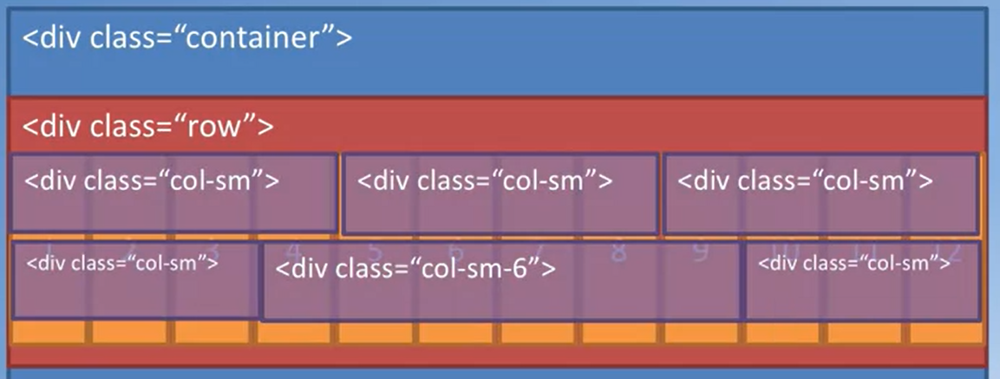
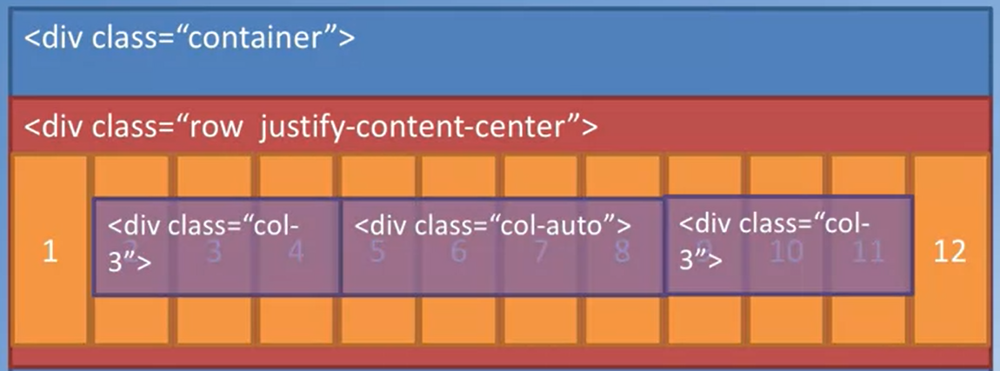

## Mobile design first! 

The more efficient approach is starting by developing html for small screen and then adapt it with larger screen. Bootstrap allow to easily handle the responsiveness needed to deal with mobile-phones. we have many elements that helps to do that:

- Grid System
- Fluid Images
- Media Queries

Media queries are one of the most important since are CSS technology to apply base on the size of the viewport. this is basically used to understand which device is watching to your websites and perform operations according to that. the grammar is as:

``` css
@media (min-width:990px){
    .container {
        width:300px;
        max-width:100%;
    }
}
```

## Grid System

is a very useful tool to responsiveness, first we have to declare in the \<head>: **\<meta name='viewport' content='width=device-width, initial-scale=1, shrink-to-fit=no'>** it ensures that the screen width is set tot he device width and the content is rendered with this width in mind.

the bootstrap grid take advantages of the css flex-box layout, it enable to more easier and flexible container. it is used to easy vertical alignment of content within parent elements, it allow easy reordering of content across devices and screen resolutions with the help of media query.

To use the bootstrap grid we first create a container that will be fix its dimensions with the screen sizes with the media query. We can also use the container-fluid which will do the fix automatically! inside we use the div class 'row'. this is the basic bootstrap grid which by default contains 12 elements.

``` html
<div class='container'>
    <div class='row align-items-center'>
        <div class='col-sm-5'> // 5 of 12
            five out of 5
        </div>
        <div class='col-sm-7'> // 5 + 7 = 12 of 12
        </div>
    </div>
</div>
```

the bootstrap grid make available five classes by default such as:

- default (which target all screen sizes)
- xs
- sm
- md
- lr 
- xl

using the classes **.col-\*, .col-sm-\*, col-md-\*, .col-lg-\*.** As we said every row is divided into 12 columns, using this classes we can *specify how many columns is each element large!* 


Using instead the **container-fluid** there is what so called auto-layout columns:



it is also possible to explicitly pass the order of the column using \<div class='col-sm-7 order-sm-first'> while using \<div class='row align-items-center'> is used to align the vertical alignment of the content while the horizontal alignment is done using: \<div class = 'row justify-content-center0>



Lastly we have to **column offsets**  it means that the element from col sm and more will be moved to the right by one. 

Remember that is also possible to nesting columns:


Basically is possible to concatenate classes just separating them with a space such as:

- \<div class='row row-content'> where row-content is my css class

Remember that:
- Justify --> horizontal
- Align --> Vertical


> <a href='https://getbootstrap.com/docs/4.0/layout/grid/'>Grid references</a>

## Navigation bar

Web site are rarely single pages. we tend to divide hierarchically the websites like a tree structure. when visiting websites the navbar is typically of the top of on the side of websites and provides the information of the websites. the best practice are to use simple anf user-friendly terms, standardize the navigation, provide indication of the location within the navigation hierarchy and use conventions such as the logo that takes you back to home page.

we also use **breadcrumbs** that indicate the navigation hierarchy in the websites such as: home->menu->appetizers (path based) which are typically placed blow the primary navigation and above the content.

\<nav class='navbar navbar-light navbar-expand-sm fixed-top bg-primary'>

bootstrap class is called navbar then we have **navbar-expand-sm** which means that for screen that are sm and larger the navigation bar will be enlarged while **fixed-top** means that the nav-bar will be stay always at the top.

\<a class='navbar-brand'>Logos</a> // inserting the logo


the use of icons is also very useful to make the rendering much better, they are a set of symbols and glyphs and they can be used like regular fonts and there are many icon font packs available. one of the most popular icon fonts is called **font awesome**. the grammar to call is:

```html
<i class='fa fa-phone'></i>
```
there are also **bootstrap-social** that are social media sign button that helps to show the contacts.

## Buttons and inputs

user interaction need to be supported from the web approaches. the interactions can be facilitated trough three approaches:

- \<a> tags to provide hyperlinks
- \<buttons> tags to create button
- \<forms> and \<input> create form and elements

## Tables

they are meant to display tabular data in a web page.

```html
<table class='table'>

</table>
```

there are different different bootstrap tables such as:
- "table-striped" for zebra striped rows
- "table-bordered" for borders to table cells
- "table-hover" for highlighting rows when you hover over a row
- "table-sm" for cutting the cell padding in half
- "table-responsive" for making the table responsive (scrolling)

individual cell and rows can also be colored such as:
- \<tr class='bg-success'> .. bh-danger and so on.

another components available elements in the **bootstrap card**. they are similar to the tables but they allow more flexibility.

## Images

bootstrap image classes provide a bounch of classes to apply to the image tag to render the image as responsive as possible such as **img-fluid**. you can also use a **img-thumbnail** which thumbnail the image and also elements to modfiy the shape of the elements such as **rounded cornes or rounded-circle**. they work very well together with the card class.

a different way is the **media** object and also the **responsive embeded** wich render the video such:

```html
<div class='embed-responsive embed-responsive-18by9'>
    <iframe class='embed-responsive-item' src='https/..'> </iframe>
</div>
```