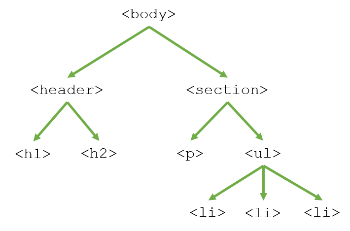
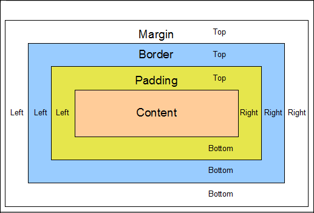
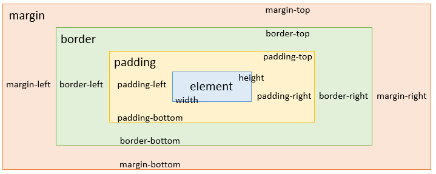
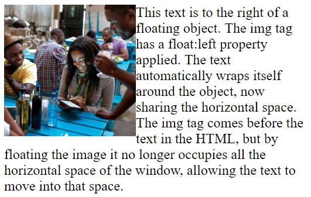

# HTML

HTML is a way to tagging the existing content so that the web browser know the elements of the page. You indicate the elements using the brackets such as < > and writing inside the elements that you are using such as tag, p and many others. Typically HTML come first.

<br/>

## Commont tags

- \<html lang="en">

The root element of a document is \<html>, and this is the first tag you'll need in your document (after the DOCTYPE, of course!). All your other HTML tags should go inside this one, meaning all HTML documents should start with \<html> at the top and end with \</html> at the bottom. It is important that you take care to use the lang attribute to indicate the actual language of text in your page because many CSS features will function differently, depending on what language is declared here.

- \<head>
       
This is the element that contains all the metadata for your site, such as your link to your CSS, the page's title and links to other files. This should be the first tag in your document, and there should only be one per document. Note that this is where you will also set the charset to "utf-8" (\<meta charset="utf-8">). 

```
<!DOCTYPE html>
<html lang="en">
    <head>
        <meta charset="utf-8">
        <title>My First Page</title>
    </head>
</html>
```

- \<p>

"p" stands for "paragraph" which is a block of text that is physically separated from adjacent blocks through blank lines. This is the most basic way to group text content.

- \<a>

By surrounding text with an \<a> tag you turn it into a hyperlink. You will want to use the "href" attribute to indicate to which target the link should take the user when clicked. The default style of the a tag is to turn the text blue and underlined, and then change the color to purple after you have clicked the link. You can adjust all these styles with CSS. 

\<a href="https://www.microsoft.com">Microsoft Main Page</a>

- \

This tag will insert an image based on the source you provide via the "src" attribute. If the source is inaccessible, you can also specify "fall back" options via the "alt" attribute. You will always want to specify the "alt" attribute with a short phrase describing the image. This text is what will be read aloud if your user is using a screen reader, or will be displayed if the user's browser will not load images. **Note that this is an example of a "self-closing" tag meaning there is no closing tag, you just end the opening tag with a forward slash**. 

\


- \<ul>

The UL tag creates an "unordered list" element, meaning a collection of elements in which the order is meaningless. This is a tag that sets the framework for you to add list elements inside it. You will want to add your elements within the ul tag each surrounded your content with list item or "\<li>" tags like in the below example.

```
<ul>
   <li>This is one element in the list</li>
   <li>One of the elements</li>
   <li>Another element</li>
</ul>
```

- \<ol>

The OL tag works exactly like the UL tag, except that the list element order matters. OL stands for "ordered list" and by default, the list element items are displayed with a number preceding them.


- \<br/>


The br element is a self-closing tag that inserts a line break. This is most evident when placed in a block of text as it essentially represents a carriage return or hitting the "enter" key. 

- \<header>

The header tag is one of the section elements, it's role is to group other HTML elements according to their role on their page. The header element contains all the introductory content on the page typically a title and tagline or navigational elements. 

- \<section>

Another sectioning element, the "section" tag is a general-purpose grouping element. It most often should include a header tag at the top. This typically will come after a header tag and before a footer tag.

- \<footer>

Another sectioning element, the "footer" tag is supposed to organize the final content on the page such as the credits or contact info. 

```
 <body>
   <header>
      <h1>My Page</h1>
   </header>
   <section>
      <h2>My Blog</h2>
   </section>
   <footer>
      <p>
         copyright 2016
      </p>
   </footer>
 </body>
```

- \<div>

The div element is a generic element to hold content. It is considered a last resort, for when no other element is suitable but is often used to collect together large portions of a site that contain multiple different types of content. 

# CSS Rules

is created by the selector and the properties, the selector is what HTML to attach to while the properties define the styles.

- Selector
This is the portion of the rule before the first open curly brace ( "{" character). This is what tells the browser what HTML tags this rule applies to. Often, you'll just see a selector that matches an HTML tag, like in this instance- our selector is just "p". However, as we get further into this course, you'll find that there are many ways to target specific HTML elements and many different ways to structure selectors so that you are targeting exactly the part of your site you want to style.

- Property
This is the portion of the rule between the two curly braces. This is what tells the browser how to style the HTML tag that has been selected. This can be as many lines of code as you choose, each of which has two parts- the property and the value you want that property to be. For our example, "color" is the property and "blue" is the value, but we could also have had a value of "black" or "#FFFFFF" (which is HEX code for white).

# Inheriting Style
Part of the reason a well structured HTML document is so important is because HTML elements inherit stylistic properties.
Tags that contain other tags are parents, and the tags inside of them are their children. Through inheritance, CSS property values set on one element will be transferred down the tree to that element's children. In this example, every element gets the same font because we applied it to the body tag. Since the body element is a common parent for all visible elements is a convenient selector for when you want to set stylistic rules for the entire document.



# Applying styles using CSS properties
<br/>

## Color properties

- color

This property sets the foreground color of an element's text content. By default, all text content will be set to black. If you set the color on one HTML element it will be inherited by all HTML elements within that. For example, if you set the color property on the body tag to blue, all text on your web page will be changed to blue, unless that text has a more specific color property that will override it.

- background-color

This property sets the background color of an element. This color then represents the exact space the element takes up, which is always a rectangular area. The default value is 'transparent' which means whatever is behind the element will shine through. Note that background-color is one example of a property that is not inherited, so you will have to directly set the background-color on each element. To set the overall color of your page, apply a background color to the body tag, and since all other element's background colors will be transparent by default, it will appear as if everything has that same background color.

- HEX

A HEX code is a 6 character code to represent the color, giving you a lot more options. The 6 characters of the code are broken into 3 sets of 2, where each set of 2 represents the amount of either red, green or blue that makes up the color. These sets are hexadecimal numbers, which means that each ranges between 00 to FF where 00 means no color and FF means all of that color. Thus #000000 represents pure black and #FFFFFF represents pure white. You can also specify colors using rgb in decimal form like so: background-color: rgb(0,204,0);

<br/>

## Font properties

- font-family

Since not all fonts are available on all computers (there are thousands of fonts, and most are not free), CSS provides a system of fallbacks. You list the font that you want first, then any fonts that might fill in for the first if it is unavailable, and you should end the list with a generic font, of which are: serif, sans-serif, monospace, cursive and fantasy. 

- font-size

CSS offers a number of different units for expressing length. Font-size sets the overall scale of your text. You can use a lot of different units to set the font size. Some of these units you are probably familiar with if you have used text editors before such as pt size or you can use px size. However, these methods are not advised because they are static and will not adapt based on screen size. It's better to use relative units, such as em, instead.

Use ems to make scalable style sheets! This is especially important for users who have special font preferences due to accessibility requirements. To use em, do not set font-size on the body tag, but instead set the size for each element in relation to the user's default. For example, 1em is the default, 2em is twice as big, 0.5em is half as big etc.

- font-weight

The weight of a font is the thickness of the letters. You can set this property using keywords with which you might be familiar: bold, normal or lighter. You can also set this property more specifically using numerical values 100, 200, 300, 400, 500, 600, 700, 800 or 900. Normal is represented as 400, whereas bold is 700.

- font-style

The font style property adjusts the angle of the letters in relation to the horizontal plane. Italic forms are generally cursive in nature while oblique faces are typically sloped versions of the regular face.

- text-decoration

Text-decoration adds a line across your text. You can set this line to be underneath your text, underline, through your text, line-through, or on top, overline.

<br/>

## Spacing properties

There are two different ways you can define white space:

in absolute terms: using an exact number of pixels,
and in relative terms: using percentages or ems.
For now, we'll use pixels because that is easier to learn. However, ultimately you will want to use percentages and ems so your content adapts to different screens.

When you view an element in your browser tools you can see the white space around it represented like so:




- Padding

"Padding" is the white space that sits closest to an HTML element. Many elements already have a default padding defined. For example, ul elements by default are indented to the left a bit because they have a left padding.

You can set the padding on an element's four sides independently using padding-top, padding-right, padding-bottom and padding-left. Or you can use the more compact padding: 10px 15px 20px 25px. In this case, the order of the numbers sets the top, right, bottom and left paddings. 

- Border

The "border" is the area outside the padding of an HTML element. By default, borders are set to be empty, but you can set their width, color, pattern, even an image! Like padding, you can even adjust the four sides of a border independent of one another using border-top, border-right, border-bottom or border-left. You can also adjust the different aspects of a border with border-width, border-color, and border-style. 

- Margin

An HTML element's "margin" is the white space that sits outside the border. Margins of HTML elements interact with one another on the page to determine how they are arranged on the page. A lot of elements have default margins applied.

For example, the body tag typically has a margin that causes any content to not extend all the way to the extreme edge of the page. Be careful, margins can be tricky. When two margins touch they "collapse" such that the space between the elements is equivalent to the larger of the two margins. Like the above properties, you can also set the margins on each side independently using margin-top, margin-left, margin-bottom and margin-right. 


# Specific HTML element targeting with CSS selectors

## ID and children

```
<div id='FirstDesign'> div content <\div>
#FirstDesign {
    margin-top: 2em;
    margin-left: auto;
    margin-right: auto;
    display: inline-block;
    padding: 0.5em;
    background-color: lightcoral;
    font-size: 1em;
    border: wheat solid;
}

#FirstDesign h1 {
    color: yellow;
}
```

## Buttons

Buttons are a key way that your users will interact with your page. Often buttons are a call to action for your user- so you will want them to stand out!

When styling a button you aren't just styling the text, but also the area around it, including the border. By giving them a distinct background color or border you make it clear that this whole area is "clickable".

Typically your user will expect your button to be wider than it is tall, to accomplish this you'll want to set the left and right padding to be greater than the top and bottom paddings. 

## Selectors advanced

We use classes and IDS to customize tags that are the same but must be rendered in a different way such as the home button or the pay button. 

- Classes

A class is an HTML attribute that specifies a name for a group of elements on the page. You can apply the class name to as many elements as you like, even if they are of different HTML tag types. You can use the class name as the selector, like so:

\<p class="className">The intro paragraph\</p>

To apply a CSS rule to a class, you must precede its name by a period ("."), like in the code below:

```
<div class= 'className'>

.className {
    color: blue;
}
```

- IDs

An ID is an HTML attribute that specifies a name or unique identifier for a particular HTML element. They are like classes with a very important distinction: the value of the ID attribute must be unique throughout the document. This lets you target a single HTML element for styling. 

```
<div id = 'ldiv'>

#div_p {
    padding: 2em;
    margin-left: 2em;
    margin-right: 2em;
    margin-top: 4em;
    background-color: wheat;
}
```

## Pseudo-classes

Pseudo-classes must always be applied to an existing selector. Their "flag character" is the colon (":").
Here are some of the most popular pseudo-classes.

- :link and :visited

These pseudo classes are the ones you are probably most familiar with. Even on this page you've probably noticed that links have different style than paragraph text. The \<a> tag by default sets the text color to blue with an underline, but have you ever seen a purple link? This is the "visited" pseudo-class that applies a different style to links that the user has already clicked. The opposite of visited is "link" which is a link a user has not yet clicked. These two states are mutually exclusive, meaning a link cannot be both at the same time.

```
a:visited {
   color: gray;
   font-style: italic;
}
```

- :hover

The hover pseudo-class is applied when the user points at an object but doesn't activate it, most commonly when they let their mouse cursor lay on top of an element without clicking. Some form factors don't support this, such as touch devices or pen surfaces. This is a really good way to encourage a user to click a link and you will often see it used in navigation bars.

```
li:hover {
   background-color: yellow;
}
```

- :focus 

The focus pseudo class applies when a user has chosen to begin interacting with an element, such as when they click into a form input field so that the input field is then ready to accept keyboard input.

```
input:focus {
   background-color: blue;
}
```

- :active

The active pseudo-class applies when an element is activated. This happens in the time between when the user clicks their mouse and they release it.

```
p:active {
   color: red;
}
```

## Contextual selectors

When you use two selectors separated by a space on a rule, you scope the rule to the elements that correspond to the selector on the right that are INSIDE the elements that correspond to the selector on the left.

```
p img {
    width: 100px;
}
```

So that all the images inside a \<p> will follow that rule.

## Cascading Rules and importance

CSS has a way to figure out which rule "wins" when styles are conflicting. CSS actually computes a "weight" for each style rule and the one with the greatest weight wins. If you want all the specifics on how this weight is computed you can read more here. For simplicity's sake, the most specific rule wins! 

- A rule is generally more specific if it applies to a fewer number of elements than another rule that encompasses those elements. The more facets a rule has the more specific it is.
   - When pseudo-classes are applied this is more specific than without the pseudo-class. For example, p:hover will win over just p. 
   - Contextual selection is more specific because it scopes the rule to elements within a certain subset of those on the page. For example, a rule that applies to all the paragraphs within articles is more specific than a rule that applies to all the paragraphs on the page.
   - IDs are most specific because you are directly applying them to the desired HTML element. The rule based on an ID will always win over other rules
- If two rules have the exact same weight, the one that comes later in the CSS document is what is applied.
- You can use the "!important" modifier on a CSS property so that it will guarantee that style will be applied. This is a way for you to override the calculated weight.

## Images

One of the easiest ways to slow down your site's performance is to include lots of large, high-quality images. There are two general things to consider when picking your images: what format and how large are they? 

- Formats
   - JPEG - Possibly the most common image format used on the web, because it does a good job of compressing colorful, complex images into reasonably sized files. JPEG is often used for photos because otherwise, photos can take a very long time to load. 
   - PNG - Provides a higher quality image, but you pay for it with a larger file size. PNG also has the ability to have transparent backgrounds, so you'll often see this used for graphics as part of the page's layout. 
   - GIF - Supports moving images and transparent backgrounds. These can be especially large files so try to use sparingly!

- Sizing

It's important to format and size your image before uploading it to your site, because while you can use CSS to resize it, the browser will download the full image even if you've chosen to display it smaller than it is. 

- Spacing

Rarely does it look nice when your content images touch your text content. You'll often want to give your images a good amount of white space surrounding them, and you can do this with padding and/or margin. In the examples below, you can see how you can even use padding and margin to achieve some interesting stylistic effects with your images. 

- Border Radius

In Module 2, we saw how you can use the "border-radius" property to make a button with rounded corners. You can do the same to images. You might even notice that it has become popular to turn square images into perfect circles, especially for icons or profile photos.

- Images as design elements

When you see complicated styles as part of a Web page's design, chances are there are images as a foundational element. For example, you will often see images set as backgrounds or as a link. Remember that you can put an  tag within an anchor tag to turn it into a link. You can also use the background-image CSS property to set an image as a background instead of just using a solid color. You can read more about background images here. 

- Text in images

It is best to overlay real text rather than use pixelated text. This makes it possible to search, copy and style the text, as well as making translation much easier. It also has accessibility benefits and makes translation much easier.

## Forms

Forms can be a surprisingly tricky element to style because you are asking for a lot of interaction from your user, and the burden is on you as the designer to make it clear what exactly you are asking them to do. However, with a few simple design changes you can make it much easier for your user to navigate your form. Here are some key design elements to keep in mind when designing forms:

- white space 

It is important to separate your form elements from your other content, otherwise it can easily be skipped over. It is also important to use white space surrounding each of your input elements to help draw your user's eye from the start to the end of your form. White space can also give the impression of simplicity and ease, an overcrowded form can seem daunting and tiring to fill out.

- borders

Possibly one of the most important design elements of your forms are borders. Borders give your user a visual clue that they should enter text, or select something from a drop down. When you eliminate all borders it is impossible to tell what is a form and what is just static text.

- labels

Each input should have a label communicating to the user what information you are asking them to submit. You will want to make sure this text is aligned and flows with the input element so it is clear what label is associated with which input. One of the easiest ways to make sure there is a label is to put the label inside the input text box as demonstrated in some of our sample designs. 

- input sizes

You can help the user quickly assess how much text you are asking them to provide by how big your input element is. A very small input element will imply that you are only asking for a small number of characters, and a very large box with multiple lines can imply that you are asking a lot more from your user. It is also important to try and gauge the input size accordingly so your user doesn't run out of space as they are entering text.

- pseudo-classes

Perhaps one of the best uses of pseudo-classes is with forms. Pseudo-classes can help provide extra feedback as your user interacts with each of your form elements. You'll often see hover used to expose more information, active used to help a user understand which element they are currently interacting with, and more.

- submit button

Don't forget some of the lessons learned in Module 2: it is important to make your button look like a button. You will want to make sure that your submit button is placed so that it is obvious after a user has entered in all the requested info.

# Layout and positioning

## Box model

The Box Model
The Box Model is how Web browsers see individual HTML elements. When laying out a document, the browser's rendering engine represents each element as a rectangular box according to the standard CSS basic box model. CSS determines the size, position, and properties (color, background, border size, etc.) of these boxes.

Each element is comprised of 4 areas: the element, the padding, the border and the margin. 



- element

This is always contained within a rectangle, even if it is a text block with jagged edges or a transparent image that isn't rectangular. Web browsers will impose a rectangle around the smallest area the HTML element's content actually occupies. Until now we've allowed the Web browser to determine the size of the element based solely on the content, but later in this section we'll learn how to adjust this sizing.

- padding

This is the white space just outside the element's content. You can set each of the four sides independently, and you can set the value to 0. If you set the element's background color, that color will apply to the padding as well.

- border 

This is the area just outside the padding. Most HTML element's border default width is 0 and thus invisible. You can set each of the four sides independently. You can set a color, a pattern, even an image. This is a great way to add horizontal or vertical lines to an element on your page.

- margin 

This is the space surrounding an element, outside the border. Margins are the part of HTML elements that interact with one another. When two margins interact the larger of the two wins meaning the smaller margin "collapses", thus the actual space between two elements is the larger of the two, not the sum of the margins.

<br/>

## Alignment properties

- text-align

If you have used a text editor before, like Microsoft Word, you've probably used the different text-align properties: left (default for English), right, center and justify. Text-align in CSS works the same way. Left, center and right specify how the lines of text within the text block are arranged. Justify sets the left and right edges of the text flush with the container's edges, which stretches the white space between words so that the overall block fits in a perfect rectangle.

Note that this property **can only apply to block elements like paragraphs, divs and headers.**

```
h1 {
   text-align: center;
}
```

- line-height

You may have noticed that the text-align property sets the content's alignment horizontally, but it leaves its vertical alignment unchanged. Text lives within a specified vertical space, in which the text is drawn by default in the middle of that vertical space. If you change the height of the containing HTML block, the text will remain at the top of the block. However, if you instead use the "line-height" property, then the block will grow and the text will vertically center within it.

<br/>

## Element width and height

- width and height

You can use pixel values for both width and height, but you'll most often want to use percentages to set these so that your elements grow and shrink as appropriate based on the screen size.

For example, if we set the width of a paragraph to 30% as you resize the browser window, you'll see how that element dynamically resizes. That's because when you use percentages, the size is computed based on the element's "containing block", or the element that contains the one you're styling. If your element is just within the body tag, the width is computed based on the relationship with the screen width.

Things are a bit more complicated with using a percentage to set an element's height. This is because typically the body's height is not specified, so if you use a percentage the size won't adjust.


- min-width, max-width, min-height, max-height


Setting width and height with percentages will save you work because your design will automatically optimize for the user's screen size. However, some elements can't grow and shrink as dynamically as text can.

For example, images will get "pixelated" if you let them grow too large, and they can look really distorted. Thankfully, you can set max and min width and heights. This way, you can set a range for your image to grow and shrink where you know it will still look good. 

Height is very important when starting use float. to allow the box to stick at the height of the elements inside use:

```
#BodySection{
    background-color: whitesmoke;
    width: 50%;
    margin: 1em auto 1em auto;
    padding: 2em 2em 2em 2em;
    overflow: hidden;  /*  <-- VERY IMPORTANT!! */
}
```

<br/>

## Padding and margin

You'll almost always want some padding and margin around your element so it's best to adjust these before progressing onto more complicated positioning methods.

Once you have set the width for your element, you can then set margins as a way to position your element relative to others. One of the most commonly used margin settings is "auto". That is because if you set an element's left and right margin to auto it will be dynamically centered within its containing block.

```
div {
   width: 50%;
   margin-left: auto;
   margin-right: auto;
}
```

**Note however, that this only works for block HTML elements like paragraphs, divs and headers. If you want to use this to position an inline element, such as img or a, you will need to tell CSS to treat them as block elements by setting display: block;**

```
img {
   display: block;
   width: 200px;
   margin-left: auto;
   margin-right: auto;
}
```

Some ways:

```
<section>
   here is text in a centered section on top of the inner div
   <div>
      centered div text within a centered div
   </div>
   and here is text in a centered section below thenner div
</section>

section {
  background-color: yellow;
  width: 70%;
  margin: 0 auto;
}
div {
  background-color: pink;
  width: 50%;
  margin: 0 auto;
}
```
<br/>

## Float property

- The float property

Up until now, we haven't moved elements very far from wherever the web browser automatically places them, but as you've probably noticed this has left our page very left side heavy. This is because, by default, elements are stacked one on top of the other, and they don't share horizontal space. With the float property, we can change this.

The float property liberates an element from its automatic position and lifts it up to "float" on top of other elements in the direction you specify.  You can specify float either right, left or the default of none. 

Elements underneath a floating object will automatically wrap themselves around the content. For example, if you float an image, the text underneath will wrap around it so that none of it is actually obscured underneath the image, but now both text and an image can share horizontal space. 




You'll often want to set the width of a floating object so that you have tighter control over the space that object occupies. Remember that, by default, block HTML elements occupy the entire width of the page, even if there isn't actual content that extends that far. In this case, you'll want to set the width so that your element's size more accurately represents its content and you don't have unnecessary white space. 

- The clear property

Once you have some elements floating things can get a little messy. Its easy for floating objects to overlap, and to prevent this you can use the "clear" property.

## Relative positioning

The "position" property sets the algorithm for how the Web browser will compute the way the HTML elements are placed on the page. There are four different value options for the position property: 

- **relative**

 This is the position setting we will be discussing in detail as it is the best way to build on the dynamic layout methods we have learned thus far. This lets you specify where an HTML element should be relative to where it would be by default.

- static

 This is the default setting and will place an element wherever the web browser computes it should be. 

- fixed

 This places an element in a specific location within the window. You can use this to set an element to remain where it is regardless of scrolling. This was used heavily when "frames" were popular, however now it should be used very sparingly. 

- absolute 

This allows you to position elements relative to their containing box. This removes an element from its normal flow (just like a floating element) so it can be difficult to control and make a layout that is truly dynamic.

```
section div{
    color: red;
    background-color: lightblue;
    position: relative;
    margin: 1em 1em 1em 1em;
    padding: 1em 1em 1em 1em;
    left:4em;
    margin-right: 150px;
}
```

In this case the div will be always centered and resized according to the screen dimensions!!

## When to use what?

Now that we are at the end of Module 4, you have a long list of different ways to move HTML elements around your page using CSS. With so many tools come choices, as you can now accomplish the same task multiple ways. Here are some guidelines on how to decide when to use which tool, in the order in which you should use them when positioning an element.

- Use padding and margin whenever you can. This will keep things simple in relation to the box model and the overall flow of elements in relation to one another.

- The float property is necessary when you want two block elements to share horizontal space. It can be easy to overuse the float property, keep in mind that if elements aren't floating the way you want them to you might want to adjust their order in the HTML instead of applying float to more and more elements.

- If the above tools aren't getting your element where it should be, you can use relative positioning and directly set the box offsets (top, bottom, left, right). This makes things a bit more complicated especially when you try to inspect the box model around your element, but sometimes this is unavoidable because of collapsing margins. 

- If all that is not enough, there are advanced CSS features such as flexbox, table layout, absolute positioning and grid layout.

## Anchor tag

```
.
.
<li><a href="#section1">section 1</a></li>
.
.
<section id="section1">
```

## Grid and Flexbox overview

Web layout is always constrained by the limitations of CSS, but future trends will be able to make use of new tools, such as CSS Flexbox (officially: CSS Flexible Box Layout) and CSS Grid.
Since the summer of 2017, the major browsers support this module of CSS, which provides the beginnings of something professional designers have long been waiting for: a design grid.
CSS flexbox and grid layout differencesIt's been a few years now that the CSS Flexbox module gives advanced control over alignment and spacing of elements on a line or in a stack. The Grid module now allows alignment in two dimensions: to elements on the same line and to elements in the same column.

Grid doesn't replace Flexbox. There is some flexibility when placing elements in one line that you lose when you add a second dimension. At the same time there are layouts that were difficult or impossible even with Flexbox and are now easy with Grid.

The Grid module is only a first step. Level 1 has a number of limitations (just like Flexbox), due to issues around complexity and performance. For example, you can currently only align elements that have the same parent. That said, for laying out graphical user interfaces (GUIs), Flexbox and Grid work very well.

We briefly present them below, and give a few resources at the bottom of the page so that you can explore more. Note: this lecture is optional and there will be no questions related to it in the final exam.

- CSS Flexbox


Since its introduction in 2012, CSS Flexbox has become widely used and its browser support is really good. Flexbox made a lot of complex layout tasks easier, like equidistant spacing between elements, top-to-bottom layouts or the holy grail. Find out about Flexbox and how to use it in the last section of the W3C HTML5 and CSS Fundamentals course!

Despite the similarities in concept and syntax, Flexbox and Grid are not competing layout techniques. Grid arranges in two dimensions, while Flexbox lays out in one. There is synergy when using the two together.

- CSS Grid


CSS Grid is a CSS module that defines a two-dimensional grid-based layout system, optimized for user interface design. In the grid layout model, the children of an element (the ‘grid container’) can be positioned into arbitrary slots in a predefined flexible or fixed-size layout grid.

If that sounds a bit too abstract, here is another way of looking at it. The idea behind the Grid module is that you split the box that makes up an element into many individual ‘slots’, arranged in a matrix, and separated from each other by (invisible) horizontal and vertical lines. You do that with a property called 'grid', which contains the desired number of rows and columns and/or their sizes. Each child element goes into a slot, so that they end up aligned as in a table. But you have full control over which slot they go into, you can change their order, they can span more than one row or column, and you can leave some slots empty.

The Grid module provides several different ways to define such a grid and to place the child elements. Too many, in fact, to present here.

Because they can refer to a previously defined grid of horizontal and vertical lines, the properties from the CSS Grid module provide more control over the alignment of elements than most other properties in CSS, such as the table-related properties or the 'float' and 'clear' properties, while also allowing elements to be displayed out of order. As such they are especially appreciated for (Web) applications with user interfaces that are made with HTML and CSS. The Grid module is not yet the ‘design grid’ that typographers want for the layout of magazines and books, but it is a first step. (E.g., one obvious thing to do, applying grid properties to an HTML table, doesn't work, because the properties do not handle nested elements yet.) Even though this is only level 1 of the module, it is well worth trying out.

The properties from the Grid module have only been available in major browsers since mid 2017 (see the status of browser support). But the ideas behind the Grid module aren't new. From the start of CSS, there have been proposals to use CSS properties to define a template or matrix to guide the layout of elements, e.g.: Frame-based layout, Advanced Layout (later called Template Layout), Grid Style Sheets and Constraint CSS. But only recently has technology become good enough to support some (not all!) of those ideas.

contens:

- https://csslayout.news/

- https://css-tricks.com/snippets/css/complete-guide-grid/

- https://gridbyexample.com/ <--Important!

- https://css-tricks.com/snippets/css/a-guide-to-flexbox/

- https://www.w3.org/TR/css-flexbox/