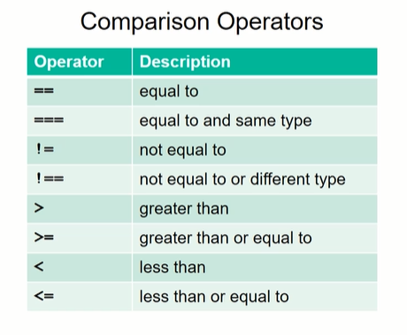
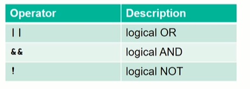
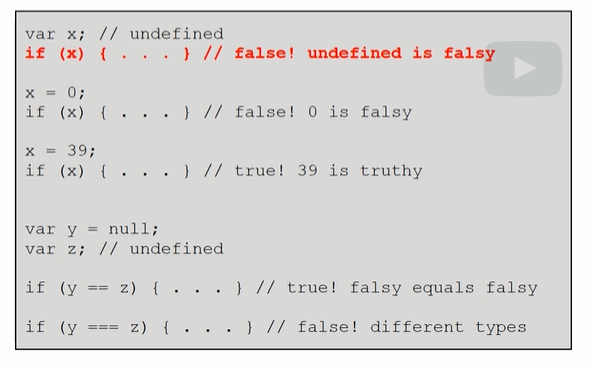
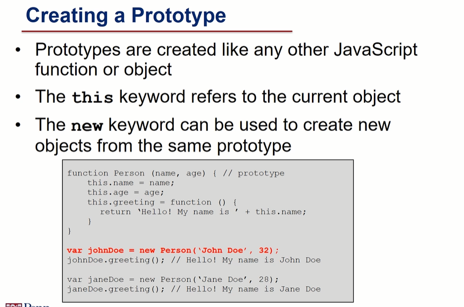

# Basics JavaScript

## JS variables

we use var to declare a variable such as

```
var age = 22;
var age = '22';
var age = false;
```

Then to see the variable we use document.write(var) or instead we can display it in log doing: consolge.log(age), or we do that popping up a small windows with alert

```
document.write(age);
consolge.log(age);
alert(age);
```

Once one variable is decleared we can change it just reassign it:

```
var age = false;
age = 22;
```

in JS we have 5 primative types:

- Number

We have normal math operations, and to increase the value by one we use <em>var ++</em> 

- String

Here we have different functions such as str.toUpperCase(), str.toLowerCase(), str_1 + str_2,

- Boolean

We have falsy value such ass null, undefined, 0, ''.

- Null

- Undefined

## Collections of object such as arrays and objects (dict)

### Arrays

They can contain elements of different elements

```
var age = [false, 1, 'twelwe'];
var subage = age[0];
console.log(age)

var age[0] = mine;
console.log(age.length);
```

if you slice an array with a too big number or to low it will return an 'undefined' type instead of error. but instead you are writing elements it change. in particular:


<br/>
<br/>
<hr>

- push() [append]

- unshift() [insert(0)]

- pop() [pop]

- shift() [pop(0)]

### Objects [python dict]

```
var person = {
    name : 'don joe',
    age : 25,
    personality : [2,3],
}
```
then we can access to the elements inside the object person using person.age or person[age]. Objects are like python dictionary.

then you can change elements inside objects accessing them with the dot or with the square brackets and modifying it without problem such as.

```
var person = {
    name : 'don joe',
    age : 25,
    personality : [2,3],
}

console.log(person.non_previous) // no prob
person.non_previous = 11 // now is setted

```

## Conditional statement

```
var a = 22;
var b = 24;
var max;

if (a > b){
    max = null;
}
else{
    max = true;
}
```

We have two more operaton then python:



also the logical operator also typed differently:



Here in java script we have to face a new problem with the == and the triple === for example:

```
1 == '1' // true
1 === '1' // false
```

Also regarding the falsy value we have some important difference!



when comparing a string to a number, js will try to conver the string to a numeric form before doing the operation. this is done also for > or < . When instead we are trying to convert a real string to a number the string will converted to NaN so it will return false


Objects are the same if and only if the name refers to the same object!

## Loops

### For loop
```
var n = 10;
var factorial =1;

for (var i = 1; i<=n; i++){
    factorial *= i
}
```
### While loop
```
var n = 10;
var factorial =1;

while (var i = 1; i<=n){
    factorial *= i;
    i ++;
}
```

 # Functions

```
function factorial(n){
    var product = 1
    for (var i = 1; i <n; i++){
        product *= 1
    }
    return product
}
```

## List functions

We can apply function to each element of a list:

```
var nums = [1,2,4,5]
function print(n){
    console.log(n)
}

nums.forEach(print)

var nums = [1,2,4,5]
function transoform_array(n){
    n = n*2
}

nums.map(transoform_array)
```

We can use also 

```
var nums = [1,2,4,5]
function print(n){
    return n>20
}

nums.every(print)
nums.sone(print)
```

The primitiva variable passed to a function are not changed by the function while array or objects yes.
as in python if the argument is a reference it will change (also dictionry!!)

Creating class object as :



# Js String

Strings in js are immutable, we have different built-in functions such as:


```
str.length return int

str.chartAt(idx) or str[idx] return string

str.trim() [same as strip] return string

str.concat(str_2) return string

str.startsWith(str_2) , str.endsWith(str_2) return bool
 
str.includes(str_2) return bool

str.search(str_2) return int (-1 if not founded)
```

## Regex

```
str.search(/WORD/) // regular expression denoted by a regex
str.search(/WORD/i)  // final /i means ignore case sensitive

/regex/.test(str) // return bool 

str.search(/[0123]/) // look for any charachters in the brackets return int
/[0123]/.test(str) // look for any charachters in the brackets return bool

str.search(/[a-z]/) // look for any lower case letter and it will return the index of the first letter

str.search(/[0-9][a-z][0-9]/) // it will return a index sse digit-letter-digit

str.search(/[^0-9a-z]/) // this is looking for something that is not between 0-9 and a-z

str.search(/^[0-9a-z][a-z]/) // start with a letter or number and a digit otherwhise false

/[a-z][0-9] * [a-z]/.test('a143284328s') return true

/[a-z][a-z] $/. test('12312az') return if end withs two letter

/^[a-z][0-9] * [a-z]$/.test('a3dasdasdsa32432a') return true
```